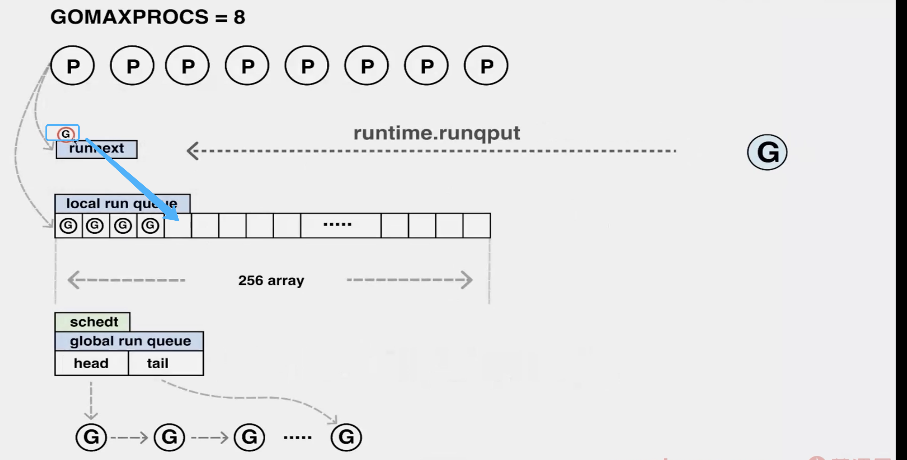
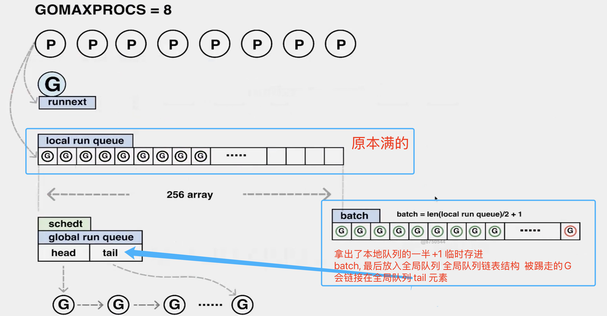
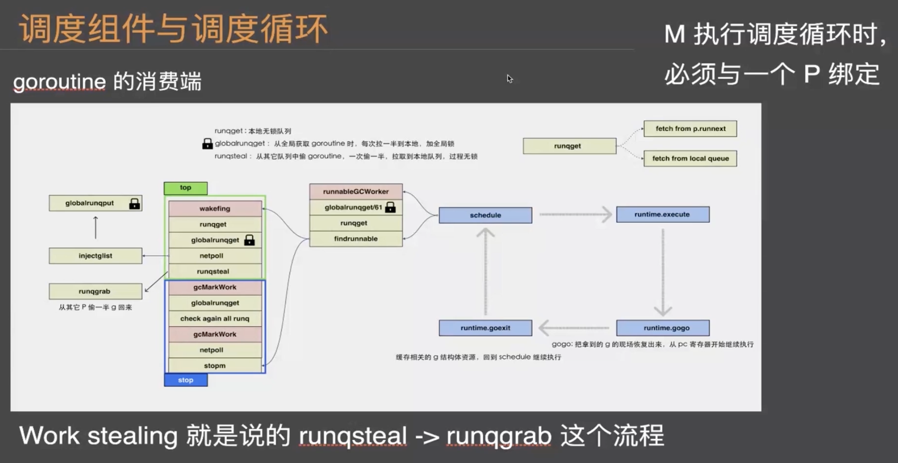
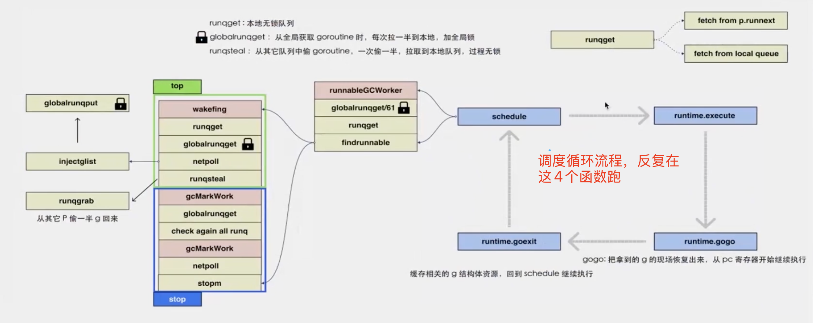
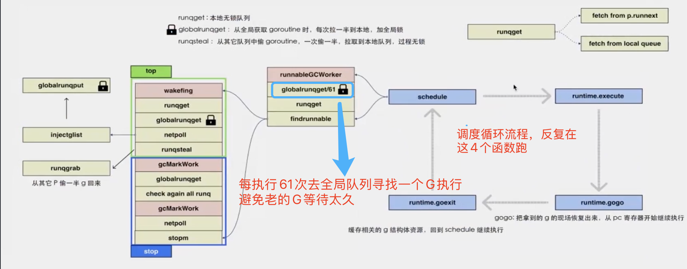
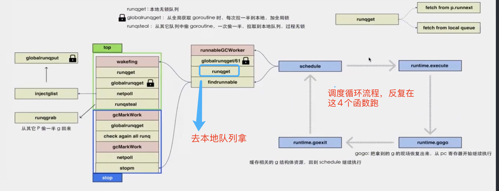
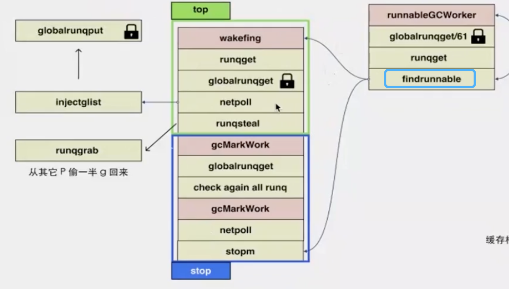

# start

## 作业

### Dockerfile跑一遍，动画原理搞懂，References有兴趣研究一下  先学学 readelf 和 dlv

```dockerfile
FROM centos
RUN
yum install golang -y \
&& yum install dlv -y \
&& yum install binutils -y \
&& yum install vim -y \
&& yum install gdb -y
```

构建包
docker build -t test .  

docker run -it --rm test bash

用课件里的 dockerfile 自己尝试看一下调度流程

## 教学目标

理解 Go 进程的启动过程，以调度循环串联相关的知识，理解 GPM 架构以及相关模型设计在不同阶段的问题及发展历史。

## 工作痛点

看着源代码，迷失在茫茫的数据结构和字段中；面试总是被人考调度循环，只是了解一些概念，无法融会贯通

## 详细内容

* Go 程序的启动过程
* GPM 模型与调度循环
* 全局队列与局部队列
* 调度模型的发展历史

## 开场闲聊

### 语言深度

调度原理、调试技巧、汇编与反汇编、内部数据结构实现、常见syscall、函数调用规约、内存管理与垃圾回收、并发编程

### 应用深度

框架原理、社区框架分析、模块分层、linter规范、中台场景实现、性能调优

### 架构广度

模块拆分、CI/CD实战(coding平台)、监控与可观测性、服务发现/信息检索/定时任务/MQ等基础设施、稳定性保障、未来架构、语言前沿

### 为什么Go语言适合现代的后端编程环境？

1. 服务类应用以API居多，IO密集型，且网络IO最多
2. 运行成本低，无VM。网络连接数不多的情况下内存占用低
3. 强类型语言，易上手，已维护

### 查看编译过程

go build -x main.go
文本文件  目标文件 做链接 临时目录

readelf -h ./x

### 汇编游戏

人力资源机器

## Go进程的启动与初始化

### 生产者消费者动画图

Goroutine 生产过程
<https://www.figma.com/proto/gByIPDf4nRr6No4dNYjn3e/bootstrap?page-id=242%3A7&node-id=242%3A9&viewport=516%2C209%2C0.07501539587974548&scaling=scale-down-width>

Goroutine 消费过程
<https://www.figma.com/proto/gByIPDf4nRr6No4dNYjn3e/bootstrap?page-id=143%3A212&node-id=143%3A213&viewport=134%2C83%2C0.06213996931910515&scaling=scale-down-width>

### runtime 包括

1. scheduler

2. nerpoll

3. memory

4. ..

goroutine 调度组件与调度循环
GPM
生产消费流程
256/2+1

## GMP

G：goroutine，一个计算任务。由需要执行的代码和其上下文组成，上下文包括：当前代码位置，栈顶、栈底地址，状态等。
M：machine，系统线程，执行实体，想要在 CPU 上执行代码，必须有线程，与 C 语言中的线程相同，通过系统调用 clone 来创建。
P：processor，虚拟处理器，M 必须获得 P 才能执行代码，否则必须陷入休眠(后台监控线程除外)，你也可以将其理解为一种 token，有这个 token，才有在物理 CPU 核心上执行的权力。

### GMP 生产消费流程

#### 队列 runnext 为空的情况下直接插入 runnext就行

#### 队列 runnext 不为空的情况下 踢走当前存在runnext的G 把自己新写入的G加入

本地队列没满（没超过256个G）的情况下 被踢走的直接写入到本地队列尾部


本地队列满了（超过256个G）的情况下：


### goroutine 消费端



M调度循环时，必须与一个P绑定
runnext：新的往这里面写，是因为局部性原理，因为刚执行完的代码有极大的可能性当前的数据以及正在访问的cpu核心的缓存里面，执行它时很快能执行完的，执行其他的会有内部的缓存调动逻辑
runqget：本地无锁队列
1.frech from p.runnext
2.frech from local queue
globalrunqget: 从全局获取 goroutine 时，每次拉一半到本地，加全局锁（全局一半：最多拉本地P大小的一半 全局队列大小 / 所有P的数量 如果可以解决问题就拿这么多）
runqsteal: 从其他P队列中偷 goroutine 一次偷一半，拉取到本地队列，过程无锁

多个线程反复在执行一个循环，这个循环是从队列里一直去拿值

globalrunqget/61   每执行61次G，就去全局寻找一个G执行，避免老的G等待太久
61:P.schedtick 每次执行 execute 函数 P.schedtick + 1
runtime.schedule --> execute --> runtime.gogo --> runtime.goexit --> runtime.schedule

schedule:
第一步就是判断 P.schedtick % 61 == 0  就会去全局队列里获取 head 元素绑定的第一个G去执行，然后维护好全局队列的head指针，拿到 schedule去执行 执行完毕运行 runtime.goexit --> runtime.schedule 调度循环

第二步就是从runnext去拿G
1.有的话直接去走调度循环执行
2.没有去本地队列找
2.1 有的情况下拿本地队列第一个G
3.没有去全局队列找
3.1 全局队列有的话，会从全局队列拿最多128个G到本地队列，会从拿的第一个去直接执行，其他的放进本地队列
4.全局队列没有，只能去其他P去寻找 偷其他P本地队列的一半，从尾部拿取，执行的是偷的尾部最后一个G去执行调度循环

runqget 如果执行61次时全局的没有，就去本地的runq去拿 优先从runnext去拿
本地runqget也没有拿到就回去寻找 findrunnable 函数

findrunnable 函数分为Top部分和Stop部分
Top:
1.本地队列拿
如果本地队列还是拿不到，加锁去全局队列(globalrunqget)里去获取
如果全局队列还是拿不到，那么回去看看当前网络的轮训情况 (newpoll)
如果在newpoll里有找到就会去 injectglist 拿一个G去执行，并且把找到的其他G放在全局队列里去
如果在newpoll里没有找到就会去 runqsteal 函数 该函数会调用 runqgrab 会从其他P里面偷一半G回来执行
注：work stealing 就是说的 runqstreal -> runqgrab 这个流程

Top部分执行完毕还是没有获取
执行Stop部分，说明M没什么机会得到执行了，那么就要进入休眠模式 stop
Stop:
1.垂死挣扎 还是回去全局队列去寻找一下 加锁
全局队列还是没有，还是回去检查所有runq，在执行一下netpoll 还是没有 那么就回去执行 stopm 函数停止运行







G:goroutine，一个计算任务。由需要执行的代码和其上下文组成，包括:当前代码位置，栈顶、栈底地址，状态等。
M:machine，系统线程，执行实体，想要在 CPU 上执行代码，必须有线程，与C语言中的线程相同，通过系统调用 clone 来创建
P:processor，虚拟处理器，M 必须获得P才能执行代码，否则必须陷入休眠(后台监控线程除外)，你也可以将其理解为一种 token，有这个 token，才有在物理 CPU 核心上执行的权力。

## 常用汇编 调用指令

go从上层到底层都是使用go实现

GO 强类型

国外一手资料

英文书 背托福单词

信息源:
github Trending(stat数多)

reddit(国外技术论坛)

acm.org

流式计算

实践

## 助教总结

```text
今天的课程可能有一些难度，这是正常的。要知道曹大当初看源码也是看了很久，各种问人，才把汇编、源码都搞明白。

我们要一步步来，一个问题一个问题地弄清楚。但也要讲究策略，一开始不要太纠结细节，先看整体再追局部。今天是一个提纲挈领性质的内容，后面曹大会一步步带大家抽丝剥茧，而我们也会对 Go 越来越熟悉，越来越有掌控感。

我说下我自己的体会，今天的课程我基本全听懂了。尤其是在听到“Go 的调度流程本质是一个生产-消费流程。”的时候，卧槽，醍醐灌顶！这一句话完全就是曹大自己融会贯通之后总结出来的，我没有在任何一篇文章上看到过这句话，但是听他讲出来，我马上就意识到：还真 TM 的就是这么回事。

所以第一次课，我听得很爽。

我想了下为什么我基本能听懂的原因，有几点，分享给大家：

1. 我前期看了很多相关的文章，并结合文章看了源码，自己也总结了一些。
2. 上课之前我预习了课件，不懂的、忘了的，又去查了一下。

很多人不预习，上来就说听不懂、太难了，其实是没有下功夫。比如说课上几次有人问 61 这个数字是啥。如果课前有预习的话，google 一下很容易就能找到答案。

当然，大家也要相信自己！学完这次课程，我们一定会攻克 Go！但是一定要花大功夫，不花功夫，带着一双耳朵，就想掌握 Go 那是不可能的。

课上听讲很重要，课下自己花时间精力研究 Go 同样很重要。而有了曹大，会让们不走弯路，并且人家是步行，我们是坐高铁。相信学完这个课程，大家和同事的水平会拉得很大。

最后，强调一点：一定要课前预习！一定要课前预习！一定要课前预习！

```
