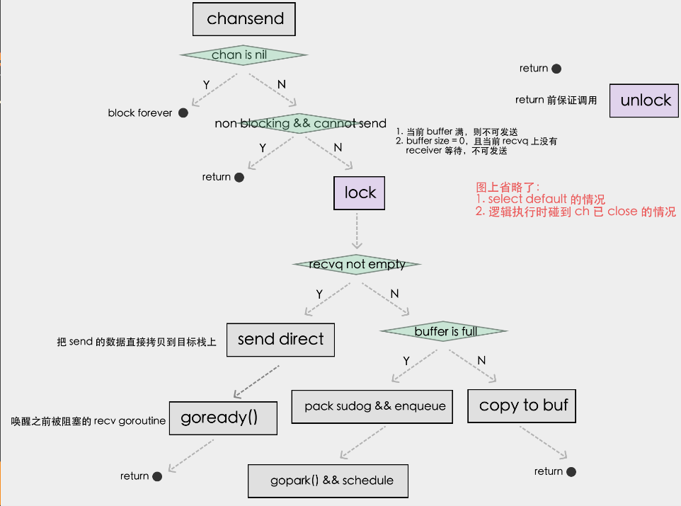
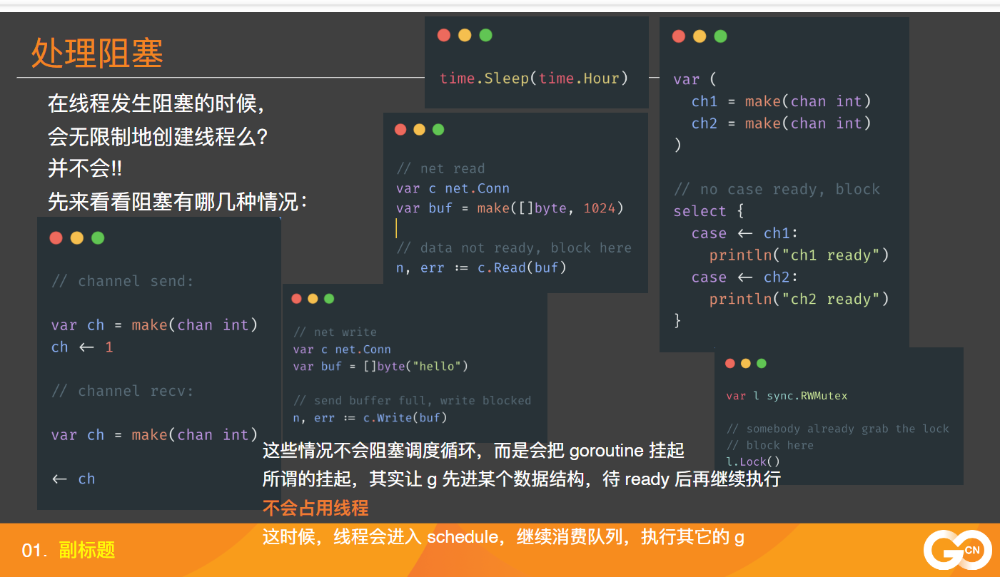
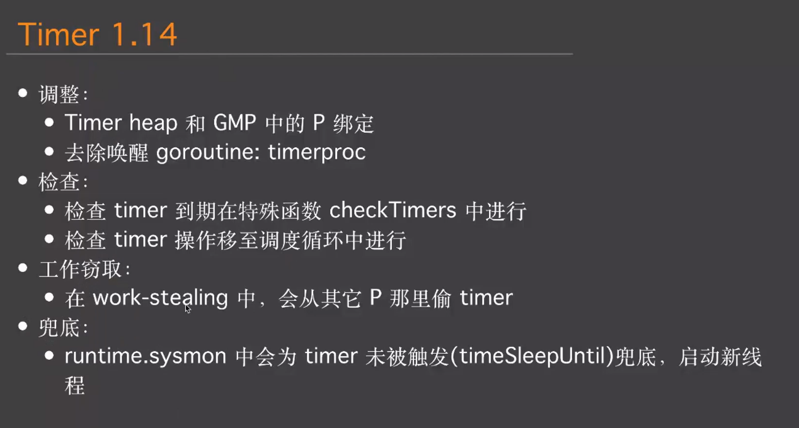
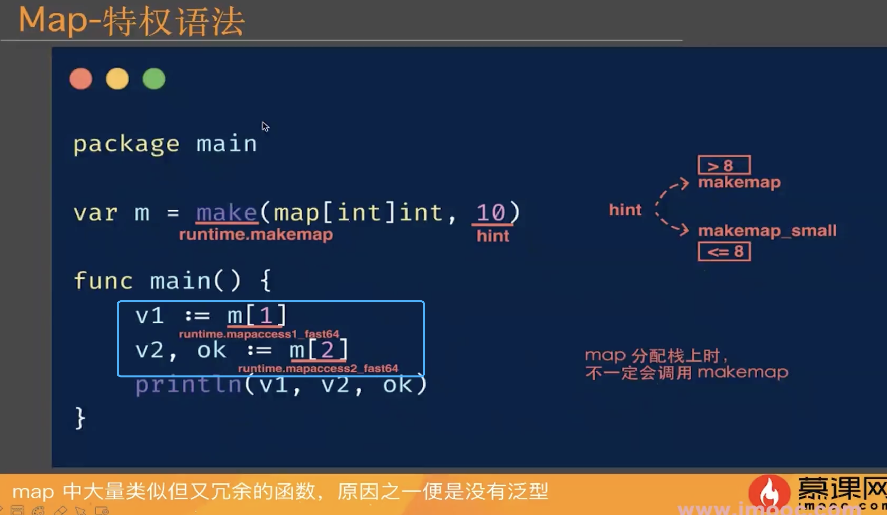
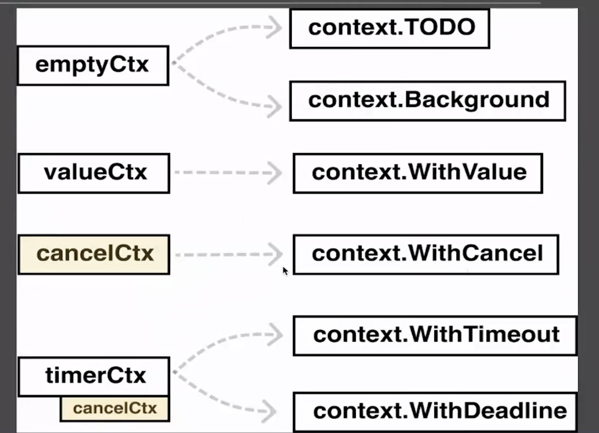
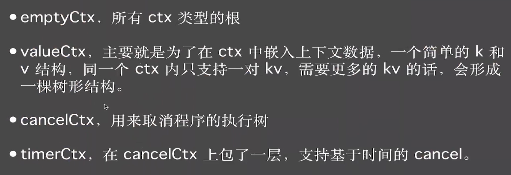

# 神奇的内置数据结构

## 内置数据结构大类

* runtime
    1. channel
    1. timer
    1. semaphore
    1. map
    1. iface
    1. eface
    1. slice
    1. string
* sync
    1. mutex(互斥锁)
    1. cond
    1. pool(对象池)
    1. once(必须执行一次的初始化函数使用)
    1. map
    1. waitgroup (汇集多个并发执行的结果)

* container

* netpoll

netpoll related(网络编程时了解)

* memory(内存 到时单独讲)

* os

* context

## channel

[动画地址](https://www.figma.com/proto/vfhlrTqsKicCO5ZbQZXgD4/runtime-structs?page-id=24%3A0&node-id=25%3A2&viewport=220%2C260%2C0.04483279958367348&scaling=contain)

### channel分两种 有 buffered 和 无 buffered

#### channel -> buffered

```go
ch := make(chan int, 3)
```

##### channel 底层数据结构

* hchan
  * qcount(当前buf长度)
  * datasize(队列大小)
  * buf(环形 数组)
  * sendx(发送时进buf的键 当buf满了回到0键)
  * recvx(接收时进buf的键)
  * sendq(当buf满了 线程保存 和channel绑定 打包sudog 写入的一个sendq队列)
  * recvq(当buf为空 sendq也为空 阻塞在recvq队列上等待写入读取 2、当buf满了 sendq有一条数据 先拿buf第一条数据然后把sendq的那一条填充到buf第一条 可实验)
  * lock(执行过程的锁)

###### channel -> unbuffered

```go
ch := make(chan int)
```

### channel 发送过程

参考图


### channel 并发安全

chansend、chanrecv、 closechan 都是要加锁的

### channel 挂起与唤醒  gopark与goready

gopark          goready

* Sender 挂起，一定是由 receiver(或close)唤醒
* Receiver 挂起，一定是由 sender (或close)唤醒
在第一课是，提到的可接管阻塞都是由 gopark 挂起，每个gopark都会有一个对应的唤醒方
  
与 gopark其对应的 goready 位置为:

* channel send -> channel recv/close
* Lock -> Unlock
* Read -> Read Ready, epoll_wait 返回了该fd事件时
* TImer -> CheckTimers 检查到期唤醒



## Timer

四叉堆


## Map

### 特权语法 (语法糖)

返回一个值也行 返回两个值也行



#### 结构

* hmap
  * count (当前map元素数量)
  * B (2的次方数量 = bucket数量)
  * noverflow (溢出桶个数)
  * hash0  (为了避免hash碰撞设置的值)
  * buckets (当前正在使用的bucket数组)
  * oldbuckets (扩容前的bucket数组)
  * extra
    * mapextra
      * nextoverflow
      * oldoverflow
      * overflow

Map扩容

* 触发: mapassign(map赋值)
* 时机: load factor 过大 || overflow bucket过多
* 搬运过程是渐进进行的

load factor过大意思是：elem count > bucket *6.5 (大概率导致hash冲突所以扩容)  ---》 bigger size grow  (这种情况会 bucket数*2扩容)

Overflow bucket过多 但整体bucket还够用 等大扩容有两个区别
novelflow >= 2^15 次方  (增大扩容)
novelflow < 2^15次方 && novelflow > bucket count (等大扩容 搬运的时候多个元素会分配到等大位置相同的bucket)
目标:map尽量扁平 不要有那么多的overflow的链表

[动画位置](http://])

元素操作
扩容中

* mapassign:将命中的bucket从oldbuckets顺手搬运到buckets中，顺便再多搬运一个bucket
* mapdelete:将命中的bucket从oldbuckets顺手搬运到buckets中，顺便再多搬运一个bucket
* mapaccess:优先在oldbuckets中找，如果命中，则说明这个bucket没有被搬运

[元素操作](http://])
  
for range 循环遍历 map结果是随机的
官方觉得 hash表本来就不保证顺序 依赖顺序是不合理的 所以故意做了随机化
r:= fastrand()
起始桶: startBucket = 3
遍历起始位置: offset = 3
两个值都是r算出来的
然后按照顺序执行遍历

什么情况发生写入 overflow
初始化时预留了两个bucket给overflow
当bucket存满了 发生了hash冲突 就会链在overflow
拉链法 链式寻址

## Context

context 包提供了一种在多 goroutine 之间传递取消信号、截止时间、和请求范围数据的机制，特别适用于需要控制并发任务生命周期的场景。

所有类型



```go
type Context interface {
    Deadline() (deadline time.Time, ok bool)  // 返回截止时间
    Done() <-chan struct{}                   // 返回一个 channel，用于接收取消信号
    Err() error                              // 返回 context 被取消的原因
    Value(key interface{}) interface{}       // 获取 context 中的值
}
```

### 使用 Context 的最佳实践

* 合理使用 context 传递数据：适合传递请求范围内的简单数据，如用户 ID、认证 token 等，不适合用于传递大量数据。

* 及时取消 context：确保 cancel 函数被调用，以防止资源泄漏。

* 避免在 context 中传递结构体指针：在 context 中传递数据时应以键值对的方式，尽量传递不可变数据，防止并发问题。

* 不要将 context 作为结构体字段：通常建议将 context 作为函数参数，避免把 context 存储为结构体的字段，以确保上下文的生命周期管理清晰。
