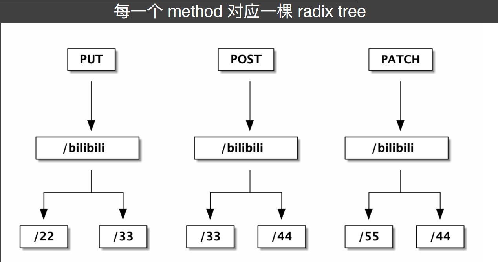
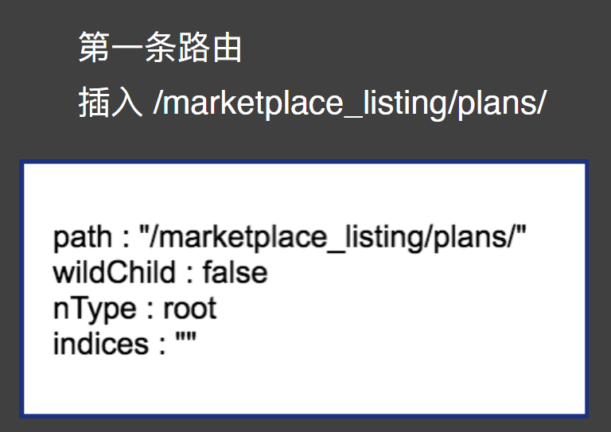
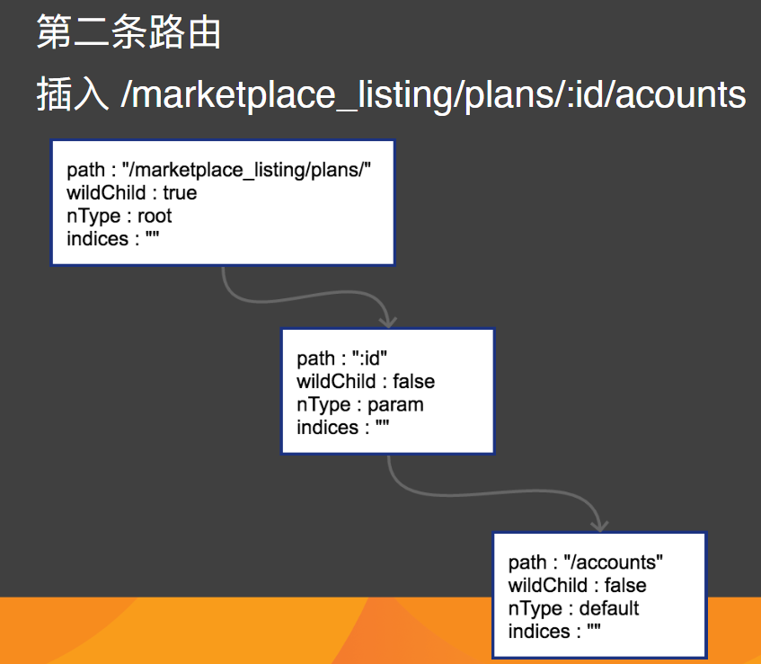
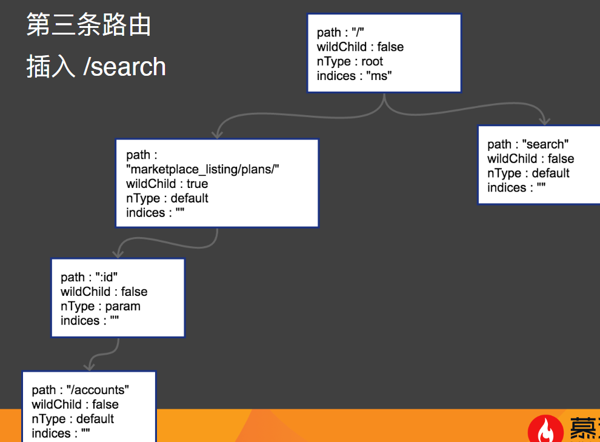
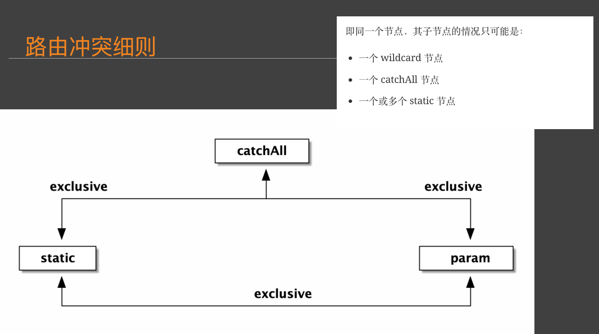
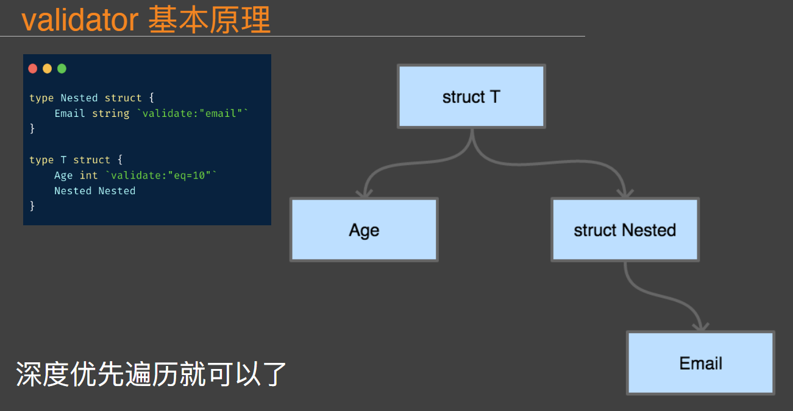
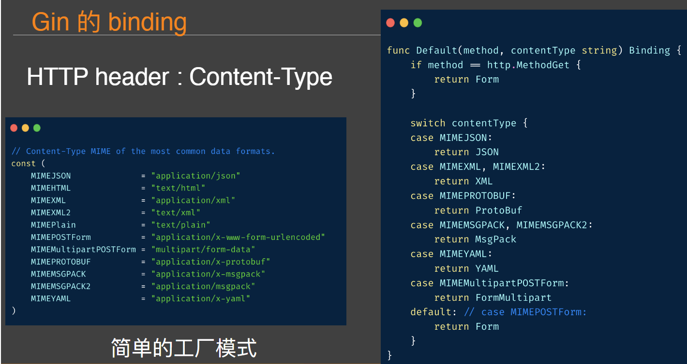

# 深入框架原理与实现

## middleware 实现
基本思路是，把功能性(业务代码)和非功能性(非业务代码)分离
#### 常⻅ middleware
https://github.com/gin-gonic/contrib

## router 实现

### Router 本质
* 字典树 trie
  * 单个节点代表一个字母
  * 如果需要对字符串进行匹配
  * 只要从根节点开始依次匹配即可

* Radix Tree
  * 同一个 URI 在 HTTP 规范中会有多个方法
  * 每一个方法树都是独立的

* http router 实现细节
  * node
    * 就是httprouter树中的节点。
  * nType (就是 node type, 有几种枚举值)
    * static // 非根节点的普通字符串节点
    * root // 根节点
    * param(wildcard) // 参数节点，例如 :id
    * catchAll // 通配符节点，例如 *anyway
  * path
    *     到达节点时，所经过的字符串路径
  * indices
      *     子节点索引，当子节点为非参数类型，即本节点的 wildChild 为 false 时，会将每个子节点的首字母放在该索引数组。说是数组，实际上是个string。
      *     如果子节点为参数节点时，indices 应该是个空字符串。
  * wildChild
    *     如果一个节点的子节点中有 param(wildcard) 节点，那么该节点的 wildChild 字段即为 true。

  * catchAll
    *     以 * 结尾的路由，即为 catchAll。在静态文件服务上，catchAll 用的比较多。后面的部分一般用来描述文件路径。如：/software/downloads/monodraw-latest.dmg。

### Radix Tree 的构造过程

### 路由冲突

- conflict:
  - GET /user/info/:name
  - GET /user/:id
- no conflict:
  - GET /user/info/:name
  - POST /user/:id
  

httprouter库:conflict 启动的时候检测出现 panic  
可以优先匹配字符串

### 路由冲突细则
 * 在插入 wildcard 节点时，父节点的 children 数组非空且 wildChild 被设置为 false。
例如：
GET /user/getAll 和 
GET /user/:id/getAddr，或者 
GET /user/*aaa 和 
GET /user/:id。

 * 在插入 wildcard 节点时，父节点的 children 数组非空且 wildChild 被设置为 true，但该父节点的 wildcard 子节点要插入的 wildcard 名字不一样。
例如： 
GET /user/:id/info 和 
GET /user/:name/info。

 * 在插入 catchAll 节点时，父节点的 children 非空。
例如： 
GET /src/abc 和 
GET /src/*filename，或者 
GET /src/:id 和 
GET /src/*filename。

 * 在插入 static 节点时，父节点的 wildChild 字段被设置为 true。在插入static 节点时，父节点的 children 非空，且子节点 nType 为 catchAll。

iamge:

## validator 实现
### validator 基本原理

[chai2010book 案例](https://github.com/chai2010/advanced-go-programming-book/blob/master/ch5-web/ch5-04-validator.md#543-原理)

## request binder (请求绑定)实现  
### Gin 的 binding

[gin 案例](https://github.com/gin-gonic/gin/blob/690aa2b1b9de7fe61dc15295210f64583dd3b90e/binding/binding.go#L90)

##sql binder 实现

