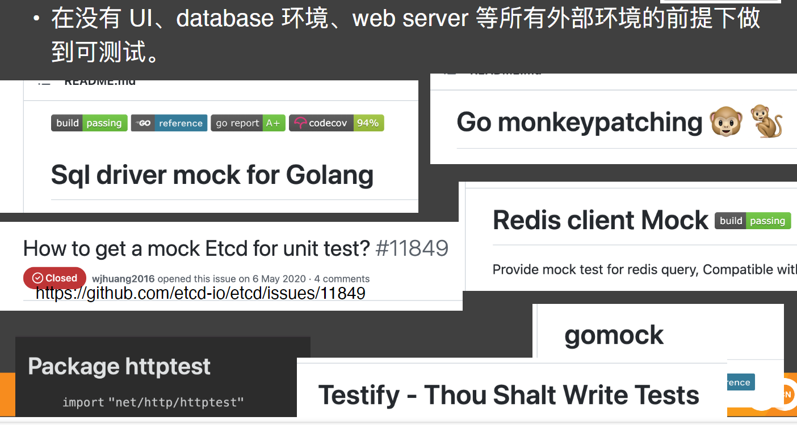

# 框架之上的业务分层

## 传统分层

### 远古时代的 web 项目
- MVC架构  

### 当前后端分离成为主流共识
- MC架构  

  
### 业务逻辑越来越复杂，拆成单独的 logic

### SOLID 中的 DIP

- 通过 DIP，我们可以做到依赖方向与程序控制方向相反

## 整洁架构的 style
### Uncle Bob 提出的整洁架构
  

[uncel-bob](https://blog.cleancoder.com/uncle-bob/2012/08/13/the-clean-architecture.html)

### 整洁架构的核心观点
- 不与框架绑定：业务不应该与某个 web 框架绑定，应该做到想换就换。
- 可测试：业务逻辑应该在没有 UI、database 环境、web server 等所有外部环境的前提下做到可测试。
- 不与 UI 绑定：不与具体的 UI 库绑定，项目应该做到随意切换外部 UI，比如可以将 web UI 替换为 console UI，同时无需业务逻辑做修改。
- 不与数据库绑定：可以把 Oracle 换成  SQL Server，也可以换成Mongo，换成 BigTable，换成 CouchDB。业务不依赖具体存储方式。
- 不依赖任何外部代理：你的业务应该对外部环境一无所知

#### 不与框架绑定

#### 可测试

#### 不与 UI 绑定

#### 不与数据库绑定

#### 不依赖任何外部代理
没有外部 agent 也能启动，做到比较难。  
- 比如你是不是经常会碰到：
    - 没有配置下发的 agent 的环节，本系统跑不起来。
    - 没有 service mesh 模块，本系统跑不起来。
    - 没有 metrics 采集模块，本系统跑不起来。

[相关github](https://github.com/bxcodec/go-clean-arch)
[使用 Go 实践 clean architecture ])(https://eltonminetto.dev/en/post/2020-07-06-clean-architecture-2years-later/)
[相关的代码](https://github.com/eminetto/clean-architecture-go-v2)

## DDD style
### DDD 社区就是名词多
- Value Object
- Entity
- Aggregate
- Repository
- Aggregate Root

[DDD 是领域驱动设计](https://blog.pragmatists.com/domain-driven-design-vs-anemic-model-how-do-they-differ-ffdee9371a86)
  

### ports && adapters

### DDD 中的战术设计-Value Object(Value Type)
Value Type 是不可变(immutable)，可比较(comparable)的值  
例如：  
数字： 1，2，3；  
字符串：“人⺠日报”，“火星探测”  
结构体：var addr = address {“100010”, “xi er qi”, “33.133”, “21.3243”}

### DDD 中的战术设计-Entity
- Entity 的关键是其有 ID 作为唯一标识
- Value type 则没有 ID
- 有 ID 意味着 entity 是可变(mutable)的，会随着时间更新

### DDD 中的战术设计-Aggregate
- Aggregate 和 entity 设计上类似，也有 ID，也是可变(mutable)的
- 聚合可以用 entity + value object 构成，如右图
- 每一个聚合对应一个 Repo interface
- 聚合需要对聚合内的数据一致性负责，可以认为聚合是数据一致性的边界
- 聚合之外的一致性采用最终一致性保证
  
- 一个聚合可以只有一个 entity
- 也可以有多个 entity 和 value object

### DDD 中的战术设计-Aggregate Root
- 聚合根也是聚合
- 与普通聚合唯一差别：聚合根对外暴露，要关联某个领域内的对象，一定是通过聚合根的 id 来进行关联的。
- 在聚合内的一些 entity 一般不对外暴露，但随着时间的推移也可能变成聚合根。

### DDD 中的战术设计-Repo Pattern
- 业务代码不会和任意数据库实现绑定

https://docs.microsoft.com/en-us/dotnet/architecture/microservices/microservice-ddd-cqrs-patterns/ddd-oriented-microservice

## 插件化架构

## 其他知识
### 依赖注入工具

我们可以使用 wire 来简化程序的初始化过程：https://blog.csdn.net/lengyue1084/article/details/116271065

# 相关url
## 一些可以参考的 API 设计指南
- 设计指南 https://github.com/RestCheatSheet/api-cheat-sheet/blob/master/README-zh-Hans.md
- 微软的 API 设计指南 https://github.com/microsoft/api-guidelines
- 微软的 API 设计指南(中文) https://github.com/xin-lai/api-guidelines
- Paypal 的 API 设计指南 https://github.com/paypal/api-standards/blob/master/api-style-guide.md#sub-resource-collection
- Paypal 的 API 设计指南(中文)https://segmentfault.com/a/1190000005924733
- Google 的 API 设计指南https://cloud.google.com/apis/design/design_patterns

### References
- 整洁架构重新思考 https://eltonminetto.dev/en/post/2020-07-06-clean-architecture-2years-later/

- Bounded-context 和 microservice怎么对应 https://vladikk.com/2018/01/21/bounded-contexts-vs-microservices/
- 贫血模式还是充血模式 https://link-intersystems.com/blog/2011/10/01/anemic-vs-rich-domain-models/
- Go 与 DDD 中的战术设计 https://www.damianopetrungaro.com/posts/ddd-using-golang-tactical-design/
- DDD 代码模板 
https://github.com/ThreeDotsLabs/wild-workouts-go-ddd-example
https://www.microsoftpressstore.com/articles/article.aspx?p=2248811&seqNum=3
- 子领域和 bounded context 的关系 http://gorodinski.com/blog/2013/04/29/sub-domains-and-bounded-contexts-in-domain-driven-design-ddd/

- 设计微服务的 domain model
https://docs.microsoft.com/en-us/dotnet/architecture/microservices/microservice-ddd-cqrs-patterns/microservice-domain-model

- Netflix 的六边形架构实践https://www.infoq.cn/article/pjekymkzhmkafgi6ycri

- 将贫血项目重构为 DDD 模式 https://blog.pragmatists.com/refactoring-from-anemic-model-to-ddd-880d3dd3d45fhttps://laiyuanyuan-sg.medium.com/mock-solutions-for-golang-unit-test-a2b60bd3e157

- Wire 简介https://blog.csdn.net/lengyue1084/article/details/116271065
