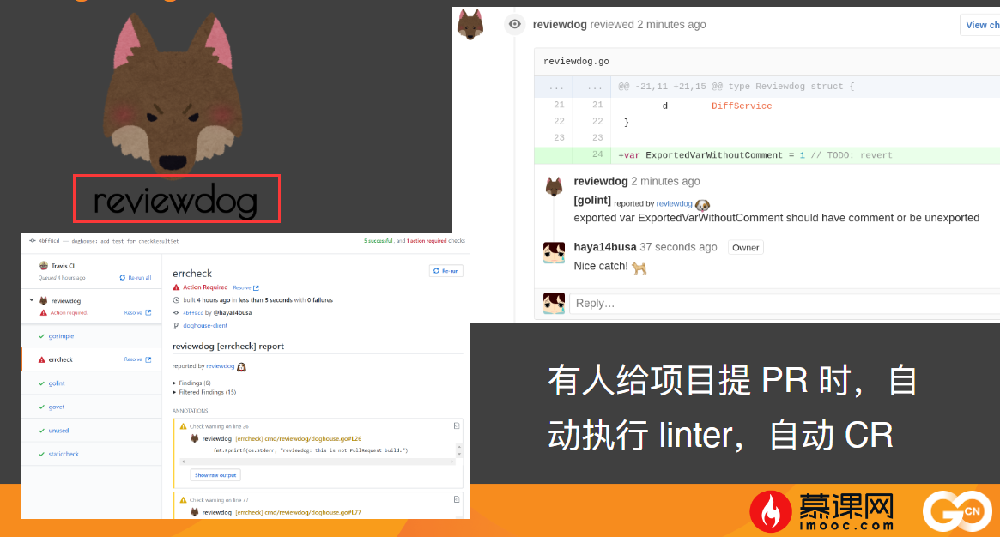
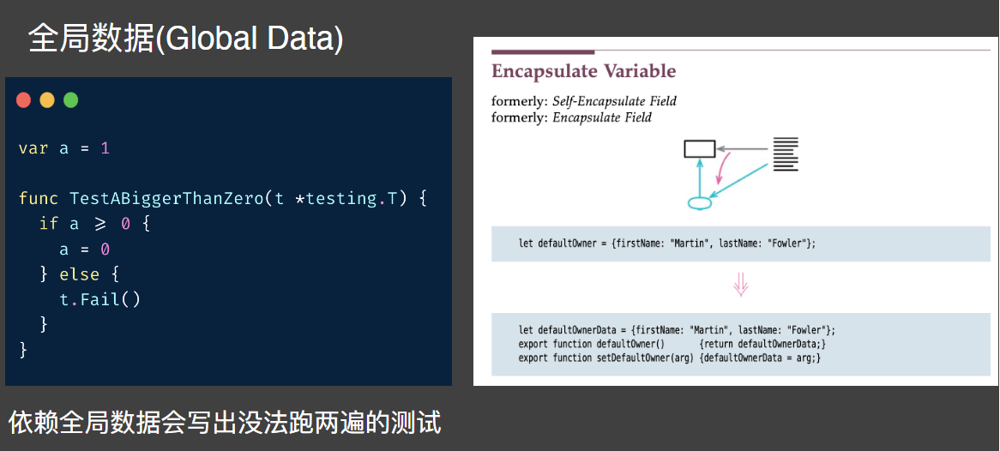

# 优雅的go代码

## Go 语言常见踩坑

### interface 与 nil比较

### err 不处理的静默失败
```go

```


### 闭包捕获循环变量
```go

```

### for range 生成的k和v始终是同一个对象
```go

```
### receiver 是值而不是指针时
```go

```

## Linter 提高代码下限

### 如果我们自己写了一个很有用的 library 想要能进 awesome-go
需要条件
- godoc.org or pkg.go.dev: True
- goreportcard.com: True
- coverage: True
  
主要是
- golint
- go fmt
- go vet
- gocyclo
- ineffassign
- misspell

###  golint
主要作用
- 检查导出函数是否有注释
- 是否有下划线的变量名、函数名
- receiver 命名是否规范

golint 是较为早期的 linter随着 gometalinter 和后续的 golangci-lint 等 linter 出现golint 现在已经 deprecated 了

### go vet
主要作用
- go vet 可以帮我们避免不少坑，比如锁拷⻉，闭包引用循环变量


### 圈复杂度检查-gocyclo
gocyclo，函数圈复杂度计算工具，计算方法：
- if +1
- switch 每多一个 case +1

因为有 if err != nil 的特殊情况，所以我们认为在 Go 语言中圈复杂度超过 15 代表函数较复杂  其它语言中该阈值一般设置为 10

### 最后一步，提交 awesome-go
有了这些储备知识，你就可以把自己的库提交到awesome-go 了。  
测试覆盖率的事情，我们在本节的测试部分讲。  
awesome-go 的质量标准其实并不是很高，我们再来看看其它的 linter。

codecov 能出一份测试覆盖率的报告

github.com/mosn/mosn

### 常⻅ linter 介绍

#### 检查错误是否被处理 errcheck
[errcheck](https://github.com/kisielk/errcheck)
```go
package main

import "net/http"

func sayHello(r http.ResponseWriter, q *http.Request) {
}

func main() {
	http.HandleFunc("/", sayHello)
	http.ListenAndServe(":10004", nil) /* err not handled*/
}
```

#### 检查 http body 是否 close
更靠谱的方案是直接给业务提供不需要关闭 body 的 http lib  
[工具地址](https://github.com/timakin/bodyclose)
```go
package main

import (
	"io/ioutil"
	"net/http"
)

func main() {
	resp, err := http.Get("http://example.com/") // Wrong case
	if err != nil {
		// handle error
	}
	_, err = ioutil.ReadAll(resp.Body)
}
```

#### 检查 sql.Rows 是否已关闭
[工具地址](https://github.com/gostaticanalysis/sqlrows)


```go
package main

import (
	"context"
)

func main() {
	db := func() {}
	ctx := context.Context(context.Background())
	rows, err := db.QuertContext(ctx, "select * from users")
	if err != nil {
		return
	}

	for rows.Next() {
		err = rows.Scan( ... )
		if err != nil {
			return nil, err // NG: this return will noe release a contection.
		}
	}
}
```

### 生产级的静态分析工具
[工具集合](https://github.com/analysis-tools-dev/static-analysis)
- golangci-lint 主流 大部分做ci的都在使用
- sonarqube 跨语言的静态检查工具
- deepsource 分类展示

### 将 golangci-lint 集成到开源项目中


### 提升项目的代码质量下限
- 将常用的 linter 都集成好，并安排在 CI 上线流程之后
- 我们的项目代码质量下限就不会太低了
- 接下来我们需要提升项目代码质量上限

集成github   .github/wordflows/reviewdog.yml
https://github.com/mosn/mosn/blob/master/.github/workflows/reviewdog.yml

https://github.com/golangci/golangci-lint

### debug.Stack()  参数信息
```go
package main

import (
	"fmt"
	"runtime/debug"
)

func sl([]int) {
	fmt.Println(debug.Stack())
}
func intrer(x interface{}) {
	fmt.Println(debug.Stack())
}
func main() {
	var s = make([]int, 9 , 12)
	sl(s)
	var i interface{} = 1
	intrer(i)
}
```

## 优雅代码  提高代码上限
### 代码的 bad smell
#### 神秘命名(Mysterious name)

#### 重复代码(Duplicate Code)

#### ⻓函数(Long Function)

#### 重复的 switch 语句(Repeated Switches)


实现下
```go

```
#### 全局数据(Global Data)
依赖全局数据会写出没法跑两遍的测试



#### 这些 bad smell 要多看看，培养自己的代码洁癖

### 额外的一些小 tips
- 可以在注释中写一些设计决策
- 通过段落来组织代码，逻辑上关联不大的内容中间要空行
- 一些纯业务性的，难以理解的逻辑也在注释里说清楚
- 通过 step1，step2，step3 等来描述较⻓的业务流程代码
- 如果你是内部工程效率的建设者，应该考虑将需求、文档、代码、迭代管理建立成为有机的整体：例如 Github 的 issue、code、pr、project 之间的关联功能

### 文档跟着代码走的一些思路
[文章](https://xargin.com/about-living-doc/)


## 如何写测试


### 单元测试

Go 的测试机制设计也是一种约定大于配置的思想，约定
- 约定一：测试代码写在以 _test.go 结尾的文件中
- 约定二：测试函数以 Test* 开头，函数应接收 *testing.T 参数

### goland 对 testify 已经做了很好的集成
[testify tool](https://www.jetbrains.com/help/go/using-the-testify-toolkit.html#compare-expected-and-actual-values)
)


### 使用 test suite 测试一个接口的多种实现
https://segment.com/blog/5-advanced-testing-techniques-in-go/  
当我们要测试一个接口的多种实现时，可以考虑使用 test suite


### 接口测试
https://stackoverflow.com/questions/42102496/testing-a-grpc-service  
使用内置的 httptest，可以在不占用端口的前提下进行 http 接口测试


### e2e 测试
- 回归测试的用例维护在公司内的专⻔平台
- 语言无关
- 模拟真实的用户行为

### 流量录制/流量回放
- 使用流量录制方案可以使用线上流量生成测试用例
- 目前 Go 没有较好的实现方法，需要修改 runtime
- 未来基于 sidecar 的新架构成为业界共识后，该方案应该会成为标配


### TDD 与 BDD 之 TDD
- 先写测试，用断言令其失败，再写实现
- 通过修改实现使测试能够通过
- 新需求也是先写/改测试
- 注重代码的可测试性
- 及时重构，小步前进

### TDD 与 BDD 之 BDD
- 用自然语言或类自然语言描述用例
- 编写用户故事/用户用例的方式写测试
- 以功能使用者视⻆描述用例
[相关工具链接 goconvey](https://github.com/smartystreets/goconvey)
[相关工具链接 ginkgo](https://github.com/onsi/ginkgo)
  
#### ginkgo ⻛格测试
```go
Describe("Shopping cart", func() {
	Context("initially", func(){
		It("has 0 items", func() {})
		It("has 0 units", func() {})
		Specify("the total amount is 0.00", func() {})
    })
})
```
#### Goconvey ⻛格测试
```go
func TestDivision(t *testing.T) {
	Convey("将两数相除", t func() {
	    Convey("除以非0数", func() {
	    	num, err := Division(10, 2)
	    	So(err, ShouldBeNil)
	    	So(num, ShouldEqual, 5)
        })          
	    
	    convey("除以0",func(){
	    	_, err :+ Divsion(10,0)
	    	So(errm SHOuldNotBeNil)
	    })
    })

}
```

https://blog.csdn.net/zwqjoy/article/details/79474196

## 错误注入原理与实现
### PingCAP 的 failpoint


### PingCAP 的 failpoint


## 如何做 Code Review
团队成员应该对代码的审美有一致的追求
- 投票制，3票通过，投票分为 +1，+2 权
- 看不懂的代码必须打回
- 这些功能目前在 Gerrit 中支持较好，gitlab 和 github 都不太行
- 通过 CR，在团队中建立 all knows all 的氛围

## References

- Go programming language 第 11 章

https://github.com/gopl-zh/gopl-zh.github.com
- PingCAP 的 failpoint
https://github.com/pingcap/failpoint
- failpoint 的设计与实现
https://juejin.cn/post/6844903837875208205
- GoConvey 测试
https://blog.csdn.net/zwqjoy/article/details/79474196
- ginkgo 测试
https://semaphoreci.com/community/tutorials/getting-started-with-bdd-in-go-using-ginkgo
- Didi 的 Go 流量录制、流量回放方案
https://github.com/didi/sharingan
