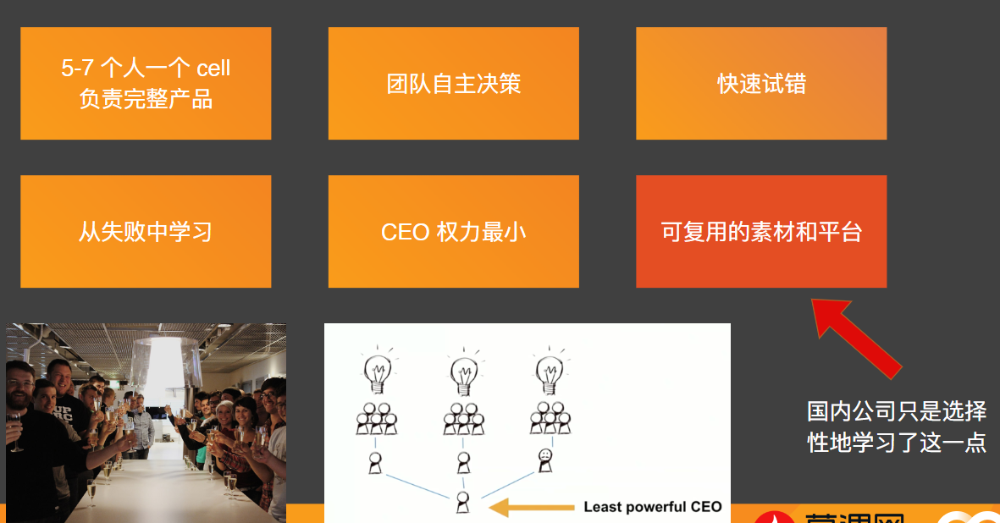
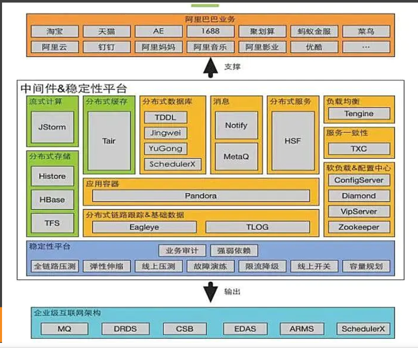
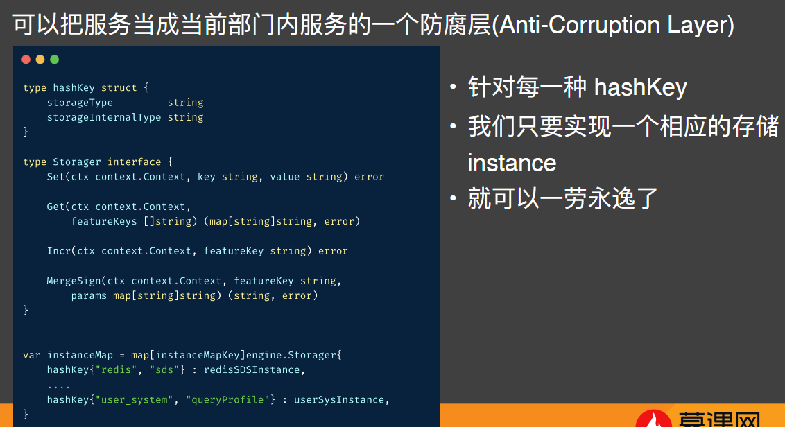

# 设计互联网高并发数据中台

## 中台到底是个啥
### 中台概念的起源
- ⻢云去 supercell 参观了一圈
- 这家北欧公司人很少(300+员工)，但营收极高
- 回国后，阿里开始进行组织架构调整与中台建设

### 中台分类-技术中台

## 数据中台的发展路径
###一个非典型的数据中台的迭代过程

## Go语言在数据中台的应用

### Google 的 F1 Query 简介
## 中台的常见问题
- 中台系统是内部 saas，非常复杂，建设成本很高
- 优先照顾大业务，忽视小业务的需求
- 政治考量太多，中台的领导为了自己的利益把前台的业务直接抢了
- 需要对稳定性进行精心设计，否则往往是架构中的单点问题
- 复杂的业务中台，对个别业务没有加速效应，反而拖累业务发展
- 某公司收购的新业务，接入中台一年都没有接完

## Crud 程序员怎么提升
- 微观上，先写好手边的代码
- 要比较懒，做过三遍的事情，就想着怎么自动化，节省出来的时间可以拿来摸⻥
- 经常上线的系统，看看能不能做到配置化，只要改配置，不用改代码
- 还是要懒，我配置都不想写，别人自己写写我来点审批就可以了 => 做平台
- 摸⻥的时候看看国外的公司同类的需求怎么做，如 Google，FB

## References

一个寓言故事，展示数据团队的发展历程：
https://erikbern.com/2021/07/07/the-data-team-a-short-story.html

Google F1 Query 2018:
https://research.google/pubs/pub47224/
https://fuzhe1989.github.io/2020/11/21/f1-query-declarative-querying-at-scale/One 

SQL to Rule Them All
https://blog.acolyer.org/2019/07/03/one-sql-to-rule-them-all/

什么是中台
https://www.jianshu.com/p/7753e64e54d8

SuperCell 的中台你们学不会
https://medium.com/@kshi/supercell%E7%9A%84%E4%B8%AD%E5%8F%B0%E4%BD%A0%E4%BB%AC%E5%AD%A6%E4%B8%8D%E4%BC%9A-e5d10290b8f6

业务中台的困境
https://mp.weixin.qq.com/s/AeUfHAcWvAs4HmyMX0rkCA
