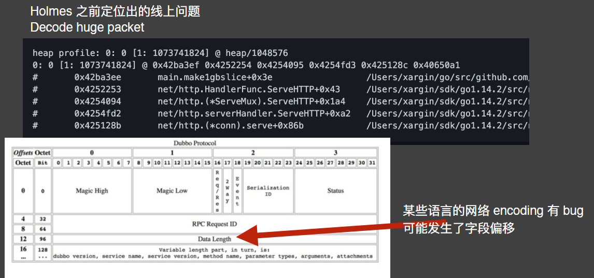

# 成为 Go 语言性能调优专家

## 优化的前置知识
### Latency numbers every programmer should know
https://colin-scott.github.io/personal_website/research/interactive_latency.html


### 优化范围
我们的新能优化主要聚焦在应用、Go标准库、Go runtime

大多数优化集中在应用代码  
极少部分在标准库和 runtime
- 应用代码Go 
- 标准库Go 
- runtime

### 优化的前置知识
- 要能读得懂基本的调用栈
- 了解 Go 语言内部原理(runtime，常用标准库)
- 了解常⻅的网络协议(http、pb)

http 协议入门
[http2](https://github.com/bagder/http2-explained)
[http3](https://github.com/bagder/http3-explained)

### 逃逸分析我们已经讲过了
用户声明的对象，被放在栈上还是堆上，是由编译器的 escape analysis 来决定的
```go
package main
func main(){
	var m = make([]int, 10240)
	println(m[0])
}
```
```shell
go build -gcflags="-m" escape.go
```

## Benchmark入门

### 案例
```go
package main

import "testing"

func BenchmarkIsPalindrome(b *testing.B) {
	for i := 0; i < b.N; i++ {
		IsPalindrome("A man, a plan. a canal: Panama")
	}
}
```

```shell
 go test -bench=IsPalindrome
BenchmarkIsPalindrome-4         1000000000               0.3502 ns/op
PASS
ok      bench   1.478s
```

### Benchmark 时可以输出 profile 输出到文件
* -cpuprofile=$FILE writes a CPU profile to $FILE.
* -memprofile=$FILE, writes a memory profile to $FILE,
* -memprofilerate=N adjusts the profile rate to 1/N.
* -blockprofile=$FILE, writes a block profile to $FILE.
* -mutexprofile=$FILE, write mutex profile to $FILE


### 字符串拼接
```go
package main

import (
	"fmt"
	"testing"
)

func BenchmarkPlusConcat(b *testing.B) {
	var main string
	for i := 0; i < b.N; i++ {
		main = ""
		main += "userid : " + "1"
		main += "localtion : " + "ab"
	}
}

func BenchmarkSprintf(b *testing.B) {
	var main string
	for i := 0; i < b.N; i++ {
		main = ""
		main += fmt.Sprintf("userid : %v", "1")
		main += fmt.Sprintf("location : %v", "ab")
	}
}
```
[案例链接](https://golearn.coding.net/p/gonggongbanji/files/all/DF39)

### Zero Garbage/Allocation

[案例链接](https://golearn.coding.net/p/gonggongbanji/files/all/DF40)

### Zero Garbage/Allocation


### False Sharing


#### 查看 CPU 详情
```shell
sh-4.4# lscpu

Architecture:        x86_64
L1d cache:           32K
L1i cache:           32K
L2 cache:            256K
L3 cache:            4096K
```
#### 查看 L1 cache line size
```shell
sh-4.4# getconf LEVEL1_DCACHE_LINESIZE
64
```
### false cache


### 我们要同时并发修改 x 和y哪一种设计更快

```go
type nopad struct{
	x uint64
	y uint64
}
type whitpad struct{
	x uint64
	_pad [7]uint64
	y uint64
}
```
[案例链接](https://golearn.coding.net/p/gonggongbanji/files/all/DF41)


### 数组横着遍历，竖着遍历，哪种更快？
[案例链接](https://golearn.coding.net/p/gonggongbanji/files/all/DF42)

```go
package main

import "testing"

var arr = make([][]int, 10000)

func init() {
	for i := 0; i < 10000; i++ {
		arr[i] = make([]int, 10000)
	}
}

func BenchmarkHorizontal(b *testing.B) {
	for i := 0; i < b.N; i++ {
		for x := 0; x < len(arr); x++ {
			for y := 0; y < len(arr); y++ {
				arr[x][y] = 1
			}
		}
	}
}

func BenchmarkVertical(b *testing.B) {
	for i := 0; i < b.N; i++ {
		for x := 0; x < len(arr); x++ {
			for y := 0; y < len(arr); y++ {
				arr[y][x] = 1
			}
		}
	}
}

```

### 局部性原理


### 一些流行的 benchmark 游戏
一些简单代码的跨语言性能对比：
https://benchmarksgame-team.pages.debian.net/benchmarksgame/fastest/go.html

Go 的 web 框架性能对比：
https://github.com/smallnest/go-web-framework-benchmark

Go 的 router 性能对比：https://github.com/julienschmidt/go-http-routing-benchmark

Web 场景跨语言性能对比
https://www.techempower.com/benchmarks/

### Benchmark 不能反映生产环境的性能问题
Benchmark Game 毕竟只是 Game

### 所以我们还需要有更宏观层面的 Benchmark 方式

来自《Systems Performance》

## 生产环境的优化
### 首先，是发现问题


### 压测时关注哪些服务指标

因为我们是 Go 的服务，还可以额外看看：
- Goroutine 数，线程数
- 如果 Goroutine 数很多，那这些 Goroutine 在干什么？
- GC 频率，gctrace 的内容(线上保存 gctrace 的话，注意硬盘类型)，GC 的stw 时间

- Memstats 中的其它指标
```go
		goroutinesDesc: NewDesc(
			"go_goroutines",
			"Number of goroutines that currently exist.",
			nil, nil),
		threadsDesc: NewDesc(
			"go_threads",
			"Number of OS threads created.",
			nil, nil),
		gcDesc: NewDesc(
			"go_gc_duration_seconds",
			"A summary of the pause duration of garbage collection cycles.",
			nil, nil),
		goInfoDesc: NewDesc(
			"go_info",
			"Information about the Go environment.",
			nil, Labels{"version": runtime.Version()})
```
[相关链接](https://github.com/prometheus/client_golang/blob/b89620c4916814c2960f16255c36d1b381cda9e7/prometheus/go_collector.go#L45)

### 方法论


#### 基本套路
1. 排除外部问题，例如依赖的上游服务(包括 DB、redis、MQ)延迟过高，在监控系统中查看

2. CPU 占用过高 -> 看 CPU profile -> 优化占用 CPU 较多的部分逻辑

3. 内存占用过高 -> 看 prometheus，内存 RSS 是多少，goroutine 数量多少，goroutine 栈占用多少 -> 如果 goroutine 不多，那么重点关注 heap profile 中的 inuse -> 定时任务类需要看 alloc

4. goroutine 数量过多 -> 从 profile 网⻚进去看看 goroutine 都在干什么 -> 查死锁、阻塞等问题 -> 个别不在意延迟的选择第三方库优化

### 压测手段
http压测工具
[wrk](https://github.com/giltene/wrk)

wrk2更实用 操作更多
[wrk2](https://github.com/giltene/wrk2)
[hey](https://github.com/rakyll/hey)
[vegeta](https://github.com/tsenart/vegeta)

压测grpc
[ghz](https://github.com/bojand/ghz)


### 高频接口滥用外部命令
在线上 exec 命令是非常危险的
#### 调用外部命令
```go
func sayhello(wr http.ResponseWriter, r *http.Request) {
	uuid, _ := exec.Command("uuidgen").Output()

	wr.Header()["Content-Type"] = []string{"application/text"}
	io.WriteString(wr, string(uuid))
}
```
#### 直接使用第三方库
```go
func sayhello(wr http.ResponseWriter, r *http.Request) {
	uu, _ := uuid.NewV4()

	wr.Header()["Content-Type"] = []string{"application/text"}
	io.WriteString(wr, uu.String())
}

```
[文件链接](https://golearn.coding.net/p/gonggongbanji/files/all/DF43)

### 阻塞导致高延迟
```go
var mu sync.Mutex
var data = map[string]string{
	"hint" : "hello world",
}

func sayhello(wr http.ResponseWriter, r *http.Request) {
	mu.Lock()
	buf := data["hint"]
	mu.Unlock()
	
	// 假设这里是一些非常慢的 io 操作
	time.Sleep(time.Millisecond * 10)

	wr.Header()["Content-Type"] = []string{"application/json"}
	io.WriteString(wr, buf)
}

```


[文件链接](https://golearn.coding.net/p/gonggongbanji/files/all/DF44)

在后端系统开发中，锁瓶颈是较常⻅的问题，比如文件锁


还有一些公司的 metrics 系统设计，本机上会有 udp 通信


#### 锁瓶颈的一般优化手段
- 缩小临界区：只锁必须锁的对象，临界区内尽量不放慢操作，如 syscall
- 降低锁粒度：全局锁 -> 对象锁，全局锁 -> 连接锁，连接锁 -> 请求锁，文件锁 -> 多个文件各种锁
- 同步改异步：如同步日志 -> 异步日志，若队列满则丢弃，不阻塞业务逻辑

### 阻塞导致高延迟-双 buffer 完全干掉锁阻塞
使用双 buffer/RCU 完全消除读阻塞  
- 全量更新：直接替换原 config
```go
func updateConfig1() {
	var newConfig = &MyConfig{
		WhiteList: make(map[int]struct{}),
	}

	// do a lot of computation
	for i := 0; i < 10000; i++ {
		newConfig.WhiteList[i] = struct{}{}
	}

	config.Store(newConfig)
}

```

- 部分更新先拷⻉原 config更新 key，然后替换
```go

// partial update
func updateConfig2() {
	var oldConfig = getConfig()
	var newConfig = &MyConfig{
		WhiteList: make(map[int]struct{}),
	}

	// copy from old
	for k, v := range oldConfig.WhiteList {
		newConfig.WhiteList[k] = v
	}

	// add some new keys
	newConfig.WhiteList[121212] = struct{}{}
	newConfig.WhiteList[23333] = struct{}{}

	config.Store(newConfig)
}
```
- 如果更新可能并发，那么在更新时需要加锁
```go

var updateLock sync.Mutex

// 如果 update 本身可能出现并发
func updateConfig3() {
	// lock update
	updateLock.Lock()
	defer updateLock.Unlock()

	var oldConfig = getConfig()
	var newConfig = &MyConfig{
		WhiteList: make(map[int]struct{}),
	}

	// copy from old
	for k, v := range oldConfig.WhiteList {
		newConfig.WhiteList[k] = v
	}

	// add some new keys
	newConfig.WhiteList[121212] = struct{}{}
	newConfig.WhiteList[23333] = struct{}{}

	config.Store(newConfig)

}
```
[文件链接](https://golearn.coding.net/p/gonggongbanji/files/all/DF45)

### CPU 使用太高了-编解码使用 CPU 过高
通过更换 json 库，就可以提高系统的吞吐量本质上就是请求的 CPU 使用被优化了我们可以使用固定 QPS 压测来验证该结论


[文件链接](https://golearn.coding.net/p/gonggongbanji/files/all/DF46)


### CPU 使用太高了-GC 使用 CPU 过高
https://github.com/glycerine/offheap

- 可以将变化较少的结构放在堆外
- 通过 cgo 来管理内存
- 让 GC 发现不了这些对象
- 也就不会扫描了
  - Off heap 也可以减少 Go 进程的内存占用和内存使用波动，但要用到 cgo
    https://dgraph.io/blog/post/manual-memory-management-golang-jemalloc/


#### 当 map 中含有大量的指针 key 时，会给 GC 扫描造成压力
```go
package main

import "testing"

func BenchmarkMapWithoutPtrs(b *testing.B) {
	for i:=0;i< b.N;i++{
		var m = make(map[int]int)
		for i:=0;i<10;i++ {
			m[i] = i
		}
	}
}

func BenchmarkMapWithPtrs(b *testing.B) {
	for i:=0;i< b.N;i++{
		var m = make(map[int]*int)
		for i:=0;i<10;i++ {
			var v = i
			m[i] = &v
		}
	}
}


```
[文件链接](https://golearn.coding.net/p/gonggongbanji/files/all/DF47)


### 内存占用过高-堆分配导致内存过高

[相关链接](https://github.com/golang/go/blob/master/src/crypto/tls/conn.go#L930)

#### 怎么样说服官方接受性能优化的 PR

[相关链接](https://github.com/golang/go/pull/42036#issuecomment-715046540)

### 内存占用过高-goroutine 数量太多导致内存占用高
这些内存的构成部分：
1. Goroutine 栈占用的内存(难优化，一条 tcp 连接至少对应一个 goroutine)
2. Tcp read buffer 占用的内存(难优化，因为大部分连接阻塞在 read 上，read buffer 基本没有可以释放的时机)
3. Tcp write buffer 占用的内存(易优化，因为活跃连接不多)


在一些不太重视延迟的场景(例如推送系统，抖一下死不了)，可以使用下列库进行优化
- evio
- gev
- gnet
- easygo
- gaio
- netpoll

一定要用自己的真实业务场景做压测不要相信 readme 里的压测数据


### 总结一下
CPU 使用太高
  - 应用逻辑导致
    - JSON 序列化
      - 使用一些优化的 JSON 库替换标准库
      - 使用二进制编码方式替代 JSON 编码
      - 同物理节点通信，使用共享内存 IPC，直接干掉序列化开销
    - MD5 算 hash 成本太高 -> 使用 cityhash，murmurhash
    - 其它应用逻辑 -> 只能 case by case 分析了
  - GC 使用 CPU 过高
    - 减少堆上对象分配
      - sync.Pool 进行堆对象重用
      - Map -> slice
      - 指针 ->  非指针对象
      - 多个小对象 -> 合并为一个大对象
    - offheap
    - 降低 GC 频率
      - 修改 GOGC
      - Make 全局大 slice
  - 调度相关的函数使用 CPU 过高
    - 尝试使用 goroutine pool 减少 goroutine 的创建与销毁
    - 控制最大 goroutine 数量
  - 堆内存使用过多
    - sync.Pool 对象复用
    - 为不同大小的对象提供不同大小 level 的 sync.Pool
    - offheap
  - Goroutine 栈占用过多内存
    - 减少 goroutine 数量
      - 如每个连接一读一写 -> 合并为一个连接一个 goroutine
      - Goroutine pool 限制最大 goroutine 数量
      - 使用裸 epoll 库(evio，gev 等)修改网络编程方式(只适用于对延迟不敏感的业务)
    - 通过修改代码，减少函数调用层级(难)
阻塞问题
  - 上游系统阻塞
    - 让上游赶紧解决！
  - 锁阻塞
    - 减少临界区范围
    - 降低锁粒度
      - Global lock -> sharded lock
      - Global lock -> connection level lock
      - Connection level lock -> request level lock
    - 同步改异步
      - 日志场景：同步日志 -> 异步日志
      - Metrics 上报场景：select -> select+default
    - 个别场景使用双 buffer 完全消灭阻塞

## Continuous profiling
### 难以发现的偶发问题
压测是一个蹲点儿行为真实场景没我们想的那么美好：
- 我们会遇到吃饭时间的 CPU 使用尖刺
- 我们会遇到半夜四点发生的系统 OOM
- 我们会遇到刚睡着时候的 goroutine 数量爆炸
- 当我们的产品被部署到客户那里时，想登陆客户的环境并没有那么方便

###压测难以发现偶发的问题
###Continuous Profiling 到底是个啥


### Continuous Profiling-Google 的办法


### 自动 dumper 能够发现的偶发线上问题一览




## 其他

### 优化模范 FastHTTP


### 语言之外的优化手段
语言以外的优化手段
- 拆进程
- 水平扩展
- 单元化

## References
Dave 以前分享的 perf workshop
https://dave.cheney.net/high-performance-go-workshop/dotgo-paris.html

Go perfbook
https://github.com/dgryski/go-perfbook

Delve 文档
https://github.com/go-delve/delve/tree/master/Documentation

Datadog 的 continous profiling 产品
https://www.datadoghq.com/product/code-profiling/

What is Continuous Profiling
https://www.opsian.com/blog/what-is-continuous-profiling/

Google wide profiling
https://research.google/pubs/pub36575/
