# 微服务在复杂业务场景的拆分难题

## 对业务的建模
### 区分业务和领域
- 业务和领域是两个概念
- 我们日常开发的系统，大多是业务系统
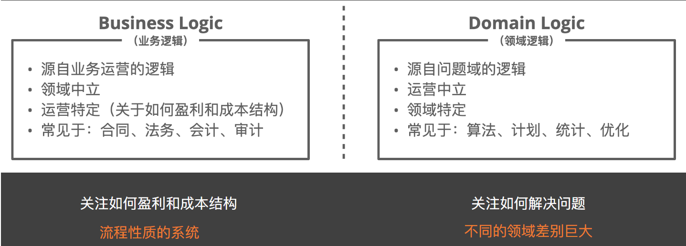

### 去医院看病的流程
大概就是这样一个流程
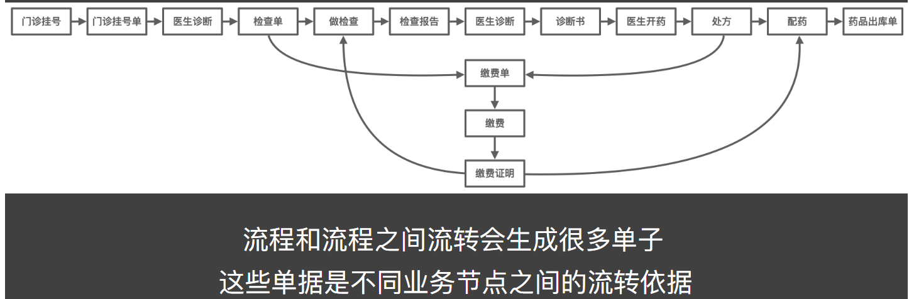

这里面一些节点是纯流程，而另一部分跟领域本身是有关系的
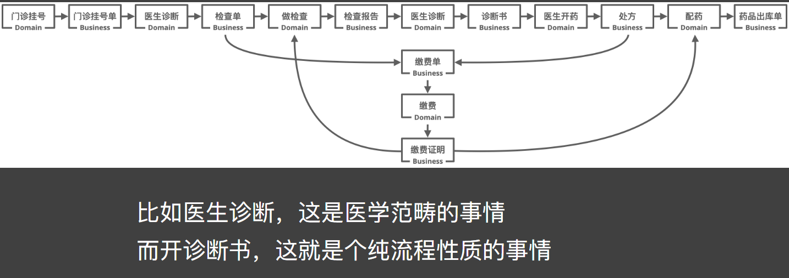

将领域和业务分开来看
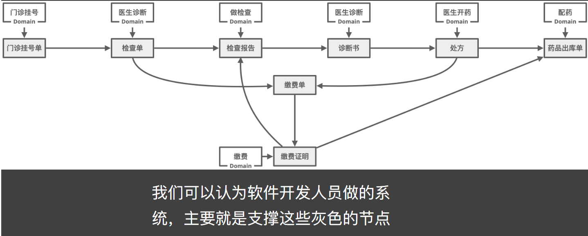

本案例摘自:https://huhao.dev/posts/2932e594/

### 业务流程是不易变的
- 有了业务模型，就有了公司业务迭代与优化的基础
- 业务流程一般(1.当公司遇到外部竞争压力2.或者内部主动想要提高运行效率 就不一定了)是不易变的，只会微调 
- 思考一下，这些年网购流程有什么大变化么？

## 单体服务的困境
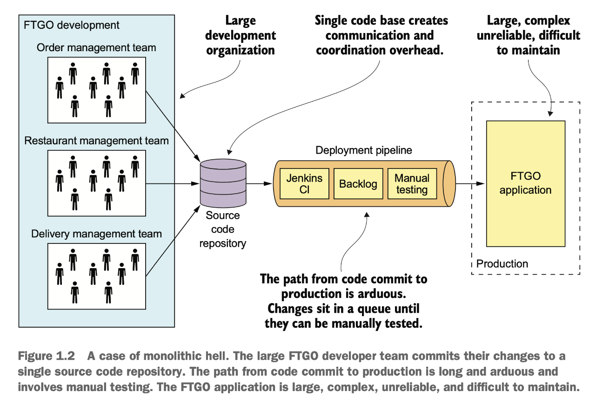
所有团队都在同一个 repo 里开发，上线走同一条流水线

服务上线有业务和稳定性的 check list：
- 错误日志是否暴增
- 上下游超时是否异常
- 业务指标是否有异常

每个上线批次有灰度时间，如：
- 第一批线上观察 15min，无异常才可以点击第二批
- 线上流量按城市开启，先从小城市开始

### 拆分后
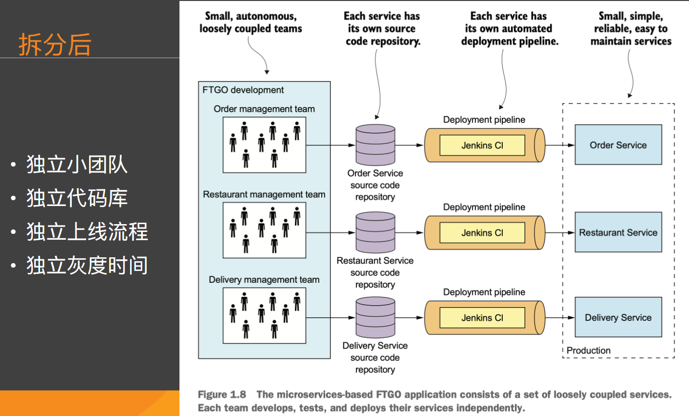
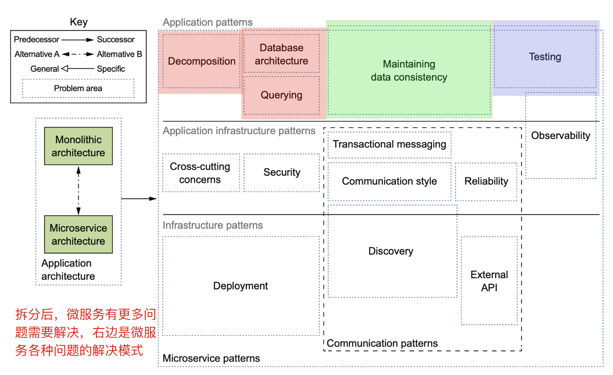

## 对单体进行拆分
### 拆分方法拆分方法
- 根据业务能力分解
- 根据 DDD 中的子域(sub domain)分解
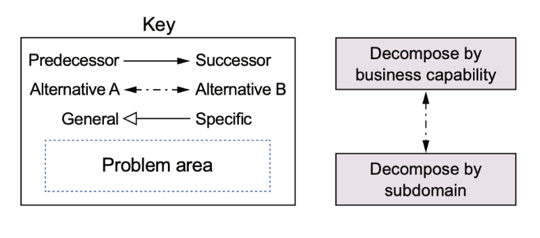

#### 按照业务能力分解
- 业务(商业)能力，说的是你这个公司是干啥的
    - 卖货的
    - 贴广告的
    - 生产电子垃圾的
- 一般都是比较稳定的
- 通过对组织的目标、结构和商业流程分析得来
- 一般包含输入、输出，服务等级协议(SLA)
#### 识别业务能力
- 供应商管理
    - 送餐员信息管理
    - 餐馆信息管理：管理餐馆的订单、营业时间、营业地点

- 消费者管理
    - 管理消费者信息

- 订单获取和履行
    - 消费者订单管理：让消费者可以创建、管理订单
    - 餐馆订单管理：让餐馆可以管理订单的准备过程

- 送餐管理
    - 送餐员状态管理：管理可以进行接单操作的送餐员的实时状态
    - 配送管理：订单配送追踪

- 会计
    - 消费者记账：管理消费者的订单记录
    - 餐馆记账：管理餐馆的支付记录
    - 配送员记账：管理配送员的收入信息
      

这些知识，我们可以通过和业务人员“聊天”习得

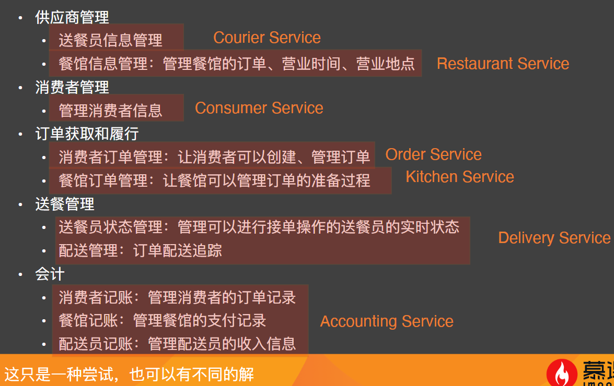
#### 按照子域进行分解
领域(domain)：你的公司在解决什么样的行业问题
子域(sub-domain)：领域内可以细分为哪些子领域。 识别子领域和前面的识别业务能力基本类似。
(这一部分着重描述的是问题空间(problem space)

限界上下文(Bounded Context)：包括实现这个子域的代码集合。每个限界上下文包含一个或一组服务。
(这一部分着重描述的是解空间，即你的代码和服务)

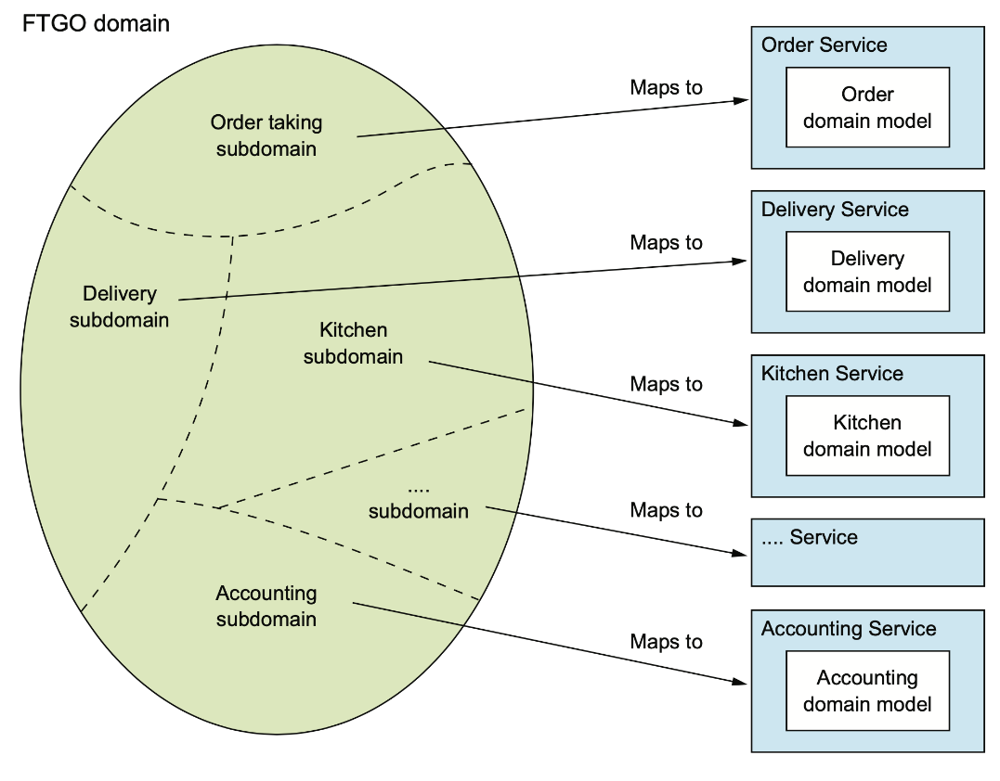
### 其它指导原则
- 单一职责原则(SRP)：一个类变更只有一个理由，一个服务变更只有一类理由
- 闭包原则(CCP)：如果两个类/服务经常一起修改，就应该把他们放在一起

### 拆分后的一些难点问题
- 网络延迟
- 服务间同步通信导致可用性降低
- 在服务间维持数据一致性
- 获取一致的数据视图
- 阻塞拆分的上帝类

## 拆分后的集成模式
###分布式服务的交互模式
- 一对一
- 一对多
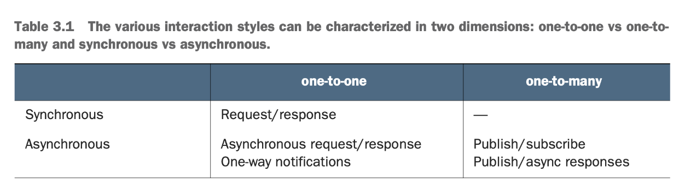
  
### 使用 RPC 进行集成-基本的 req/resp 模式
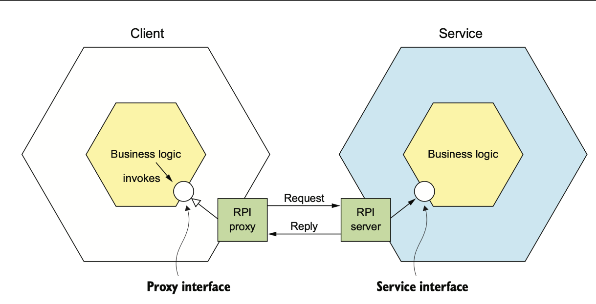
- 协议和框架：
  - gRPC
  - Thrift
  - Websocket
  - RESTFul
  
- API版本管理：
  - MAJOR—When you make an incompatible change to the API
  - MINOR—When you make backward-compatible enhancements to the API
  - PATCH—When you make a backward-compatible bug fix

### 使用 RPC 进行集成-不能被上游服务拖死
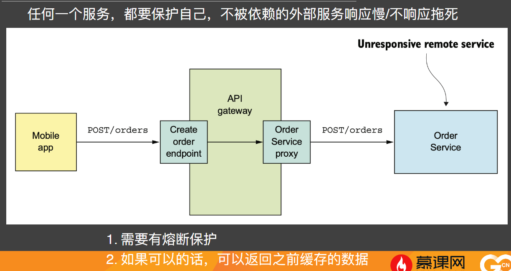

### 使用 RPC 进行集成-服务发现-客户端发现
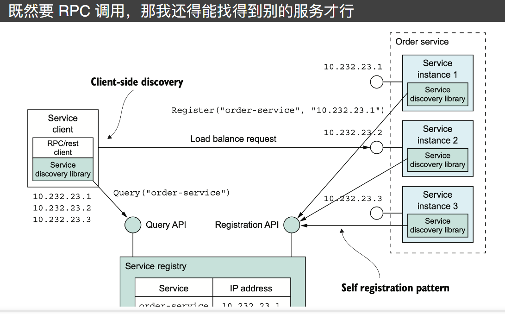

### 使用 RPC 进行集成-服务发现-DNS
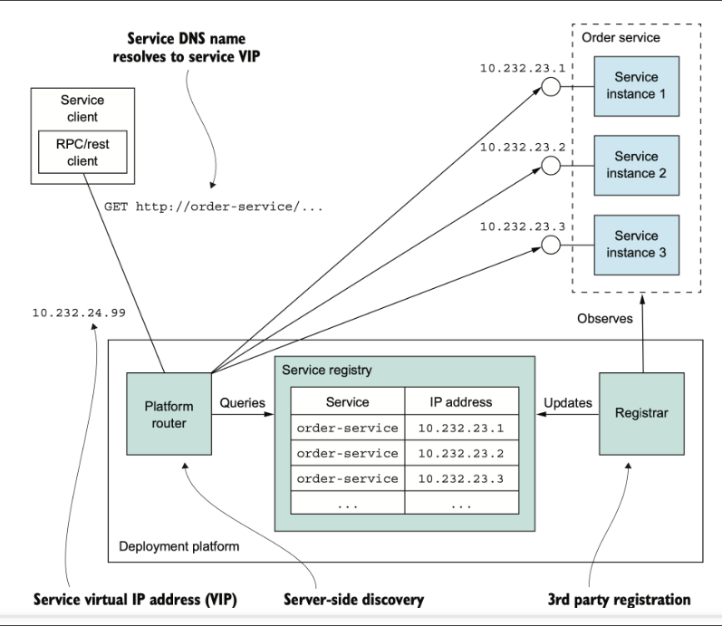

### 使用异步消息(domain event)进行集成
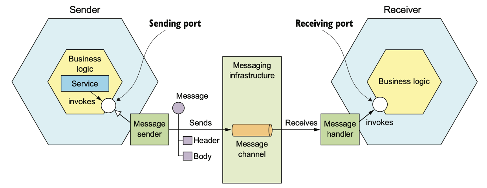

### 使用异步消息也可以模拟 RPC 的行为-不过尽量不要这么玩
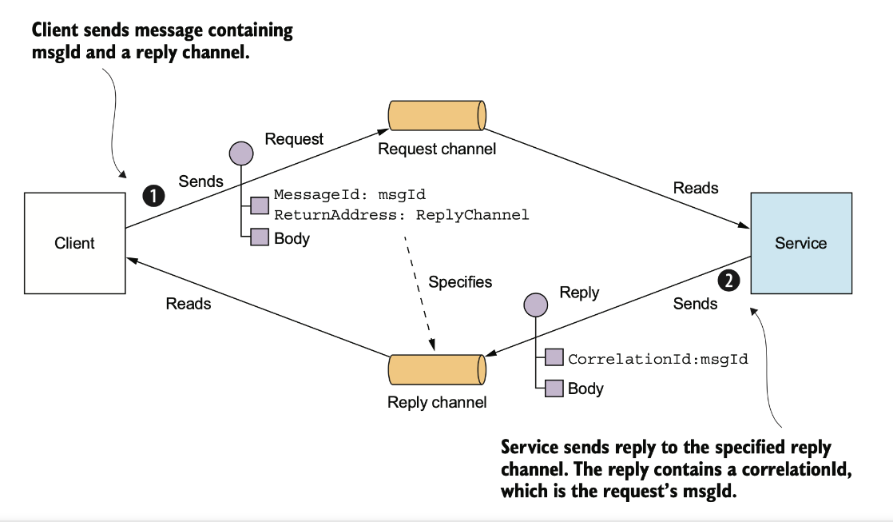

### 异步消息-Broker less 和 broker based 架构
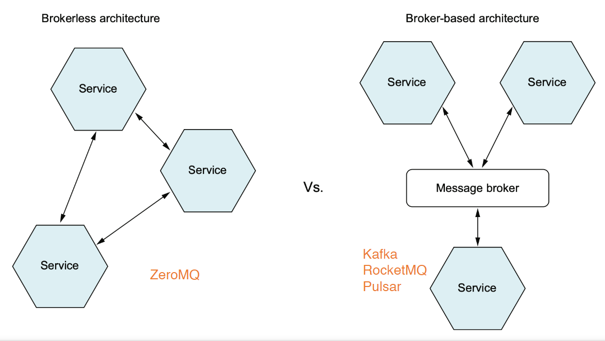

### Event Sourcing-基本概念
- 数据库中不记录最终状态，而是记录所有修改历史，以方便回溯

### Event Sourcing-计算加速
- 因为每次都计算全量数据实在太慢
- 因此每过一段时间会进行一次快照计算

### Event Sourcing-缺陷
- 事件本身结构变化时，新老版本兼容比较难做
- 如果代码中要同时处理新老版本数据，那么升级几次后会非常难维护
- 因为容易追溯，所以删除数据变得非常麻烦，GDPR 类的法规要求用户注销时必须将历史数据删除干净，这对 Event Sourcing 是一个巨大的挑战

基于 MQ 解耦了，然后呢？
- 这个数据我需要，你能不能在消息里帮我透传一下
- 你重构的时候怎么把这个字段删掉了，我还用呢
- 你们原来状态机变三次都有 event，怎么现在就剩两个了
- 你们 API 出故障，为什么消息顺序就乱了？

https://xargin.com/mq-is-becoming-sewer/

## 微服务中的查询模式
### API 组合模式
- API 组合器：它通过查询数据提供方的服务来实现查询操作
- 数据提供方：拥有部分数据的服务

### API 组合模式-劣势分析
- 谁来负责拼装这些数据？有时是应用，有时是外部的 API Gateway，难以定下较好的标准
- 增加额外的开销-一个请求要查询很多接口
- 可用性降低-每个服务可用性 99.5%，实际接口可能是99.5^5=97.5
- 事务数据一致性难保障-需要使用分布式事务框架/使用事务消息和幂等消费

### CQRS
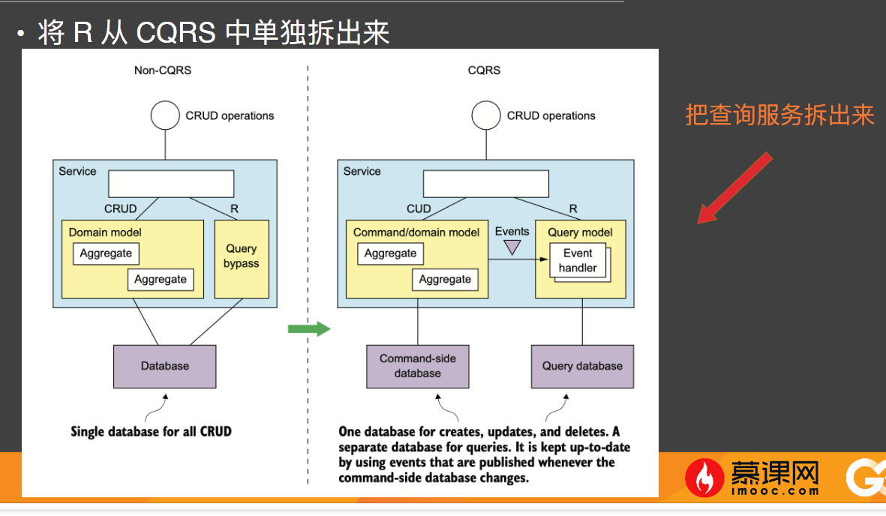

### CQRS-订单历史服务
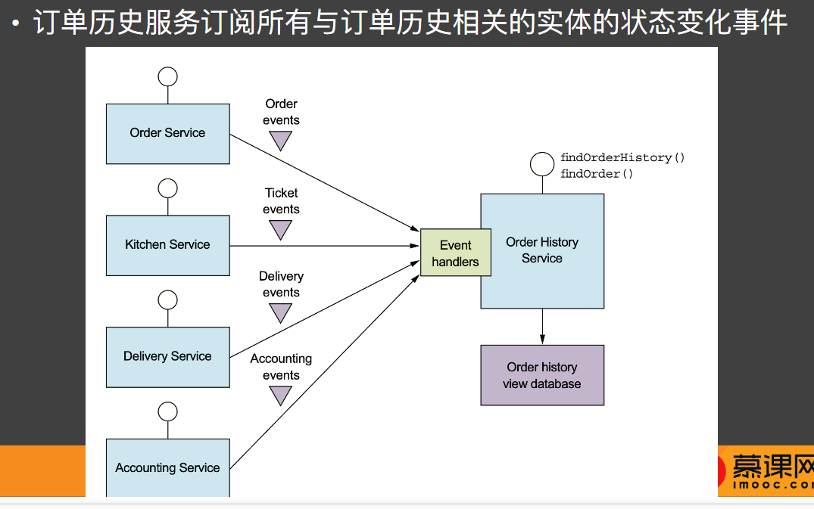

### CQRS-订单历史查询

### CQRS-消费者幂等问题
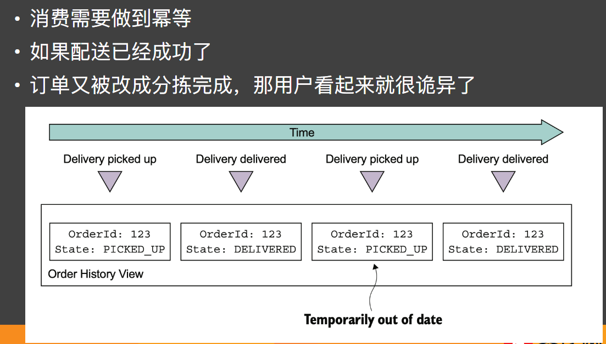

### CQRS-劣势分析
- 架构复杂
- 数据复制延迟问题
- 查询一致性问题
- 并发更新问题处理
- 幂等问题需要处理

## 外部API模式

### 为什么需要 API Gatewa
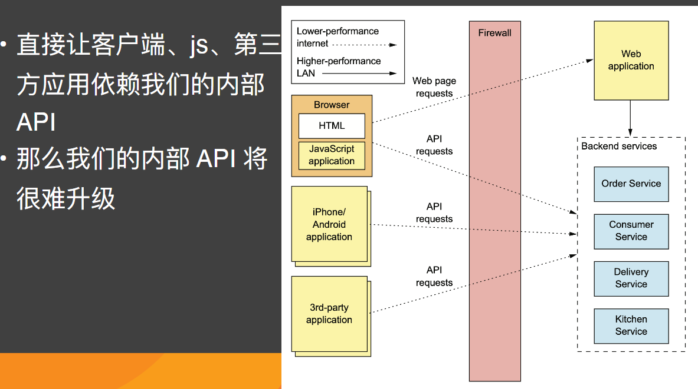
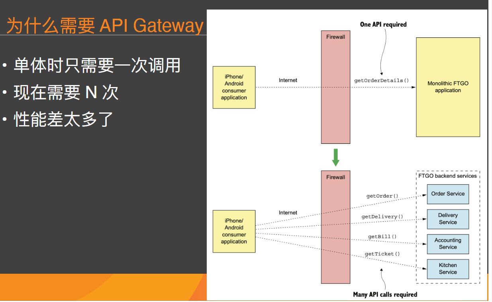

### API Gateway
- API Gateway 要负责 API 数据的组合
- 同时要实现那些“边缘”功能：
  - 身份认证
  - 权限控制
  - 限流
  - 缓存
  - Metrics
  - 请求日志
  - 请求路由
  - 协议转换

    
### 一般情况下，一种类型的设备一个 Gateway
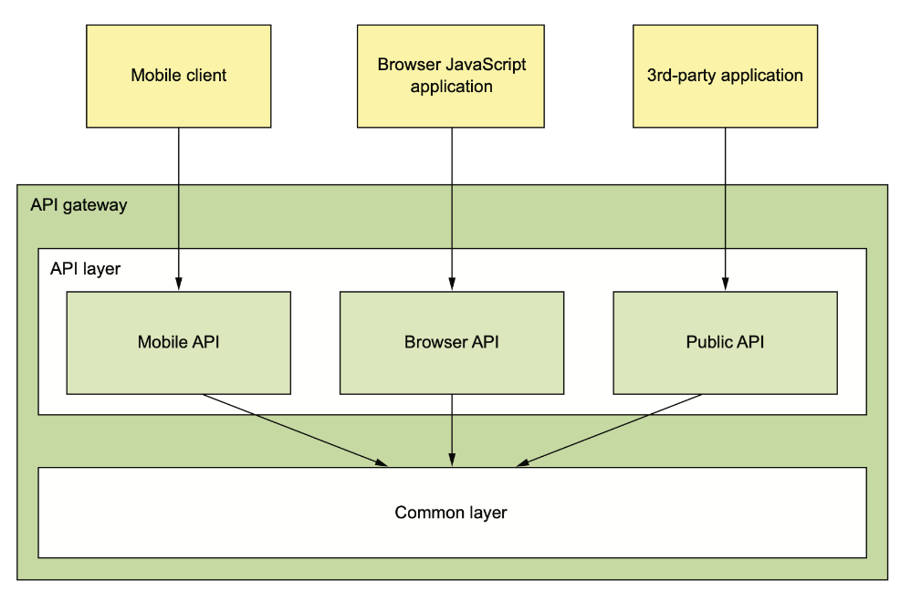

### BFF 模式
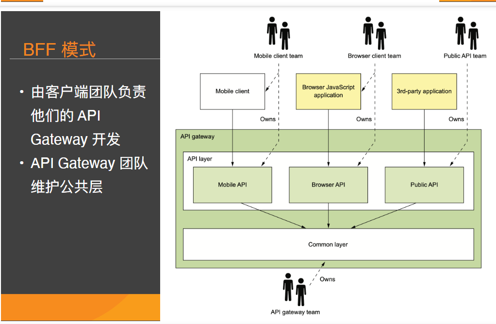

### API Gateway 实现手段

- 直接使用开源产品
  - Kong
  - APISix
  - Traefik

- 自研
  - Zuul
  - Spring Cloud Gateway
  - RESTFul 自己做一个
  - GraphQL 自己做一个

GraphQL-为什么限流才是 GraphQL 最麻烦的问题
- 网关容易被客户端的修改直接带崩
- 中文互联网上讲 GraphQL 的基本都没有提到限流，或者一笔带过，这是不太负责任的，就不点名批评了
- 可以参考 shopify 的分享做一些尝试

https://shopify.engineering/rate-limiting-graphql-apis-calculating-query-complexity

## References
MQ 正在成为臭水沟
https://xargin.com/mq-is-becoming-sewer/

Data Validation for Machine Learning
https://blog.acolyer.org/2019/06/05/data-validation-for-machine-learning/

8x flow 业务建模
https://huhao.dev/posts/2932e594/

Why REST Keeps Me Up At Night
https://www.programmableweb.com/news/why-rest-keeps-me-night/2012/05/15

Shopify 的 GraphQL 限流实践
https://shopify.engineering/rate-limiting-graphql-apis-calculating-query-complexity

微服务各种科普
https://microservices.io

