# 一线互联网公司的CI/CD实践

## 部署流水线

### 软件部署的反模式

手工部署软件            ---》 部署流水线
开发完部署              ---》 持续集成/部署 
生产环境手工配置管理     ---》 配置管理系统

### 一个典型的部署流水线
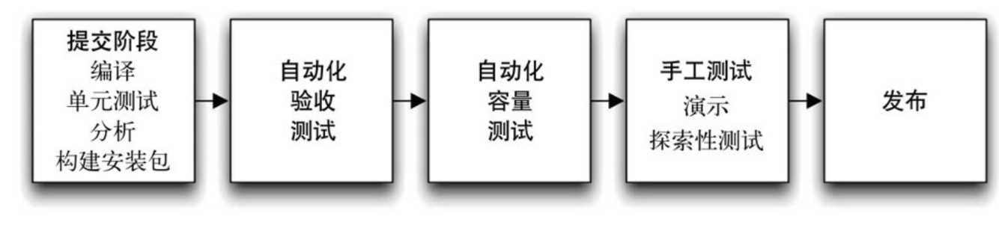
- 让软件构建、部署、测试和发布过程对所有人可见，促进了合作
- 它改善了反馈，以便在整个过程中，我们能更好的解决问题
- 它使团队能够通过一个完全自动化的过程在任意环境上部署额发布软件的任意版本

### 软件交付的原则
* 软件发布应该是可重复，且可靠的过程
* 将几乎所有事情都自动化
* 把所有软件相关的物件都纳入版本控制
* 提前把频繁地做让你感到痛苦的事
* etc...


## 代码和配置管理

### 版本控制
- 常见的 Git workflow
- Github Network演示
- 线下可以使用GitUP来查看一个开源项目的提交和合并历史
- CR的投票机制
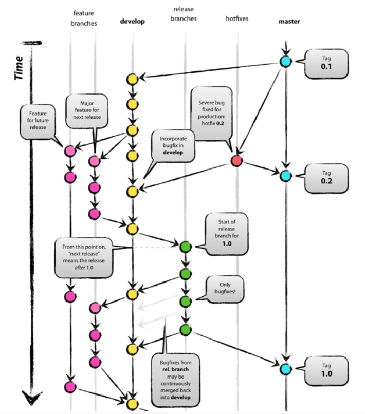


### 依赖管理
- Java： maven，gradle
- Go：go mod，功能设计上有些偏执
- JS：npm，历史上发生过 leftpad 删库事件
- Rust：cargo，没有 namespace 是个败笔，占着茅坑不XX
- C/C++：苦

### 软件配置管理
- 构建时：在生成二进制文件时，构建脚本可以在构建时引入相关的配置，并将其写入新生成的二进制文件。
- 打包时：在打包时将配置信息一同打包到软件中，比如在创建程序集，以及打包ear或gem时。
- 部署时：在安装部署软件程序时，部署脚本或安装程序可以获取必要的配置信息，或者直接要求用户输入这些配置信息。
- 启动后：软件在启动或运行时可获取配置。

### 软件配置管理
- go build tags
- 不同机房不同的数据库地址
- 有些进程依赖 agent-a，有些进程依赖 agent-b
- 功能开关
- A/B 逻辑配置
- 灰度控制配置

### 开关配置
#### 功能开关：功能先上线，用开关决定是否开启
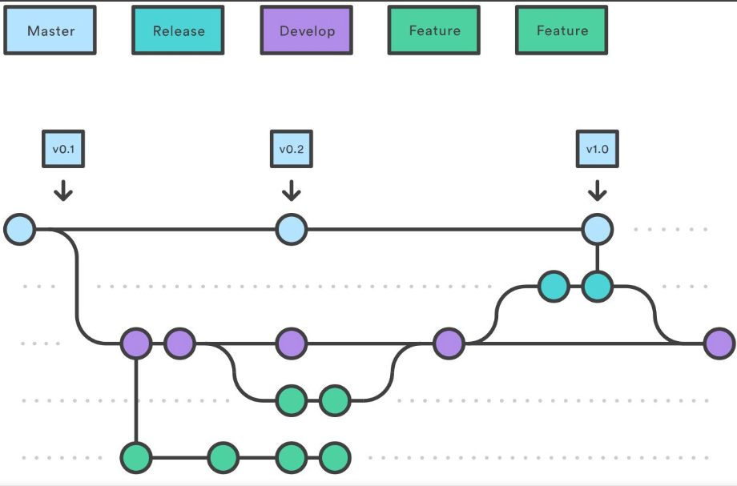

#### 实验开关： A/B实验开关


#### 灰度开关：按城市、人群特征、手机号、随机百分比等比例开启功能
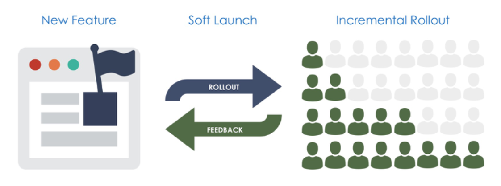

#### 权限开关：按用户的会员等级开启不同的功能


### 各种开关的生命周期
- 纵轴表示开关的生命周期
- 横轴表示变化频度
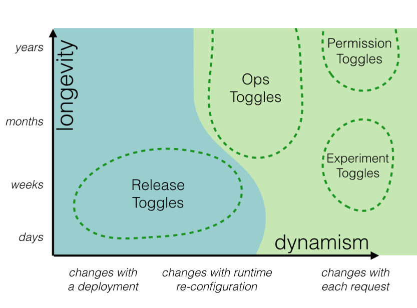
- 开关全部开启之后可删除的  以及删除开关相关代码 有请求和存储压力

### 开关管理系统架构图
 缓存 请求不到服务拿上一次的值
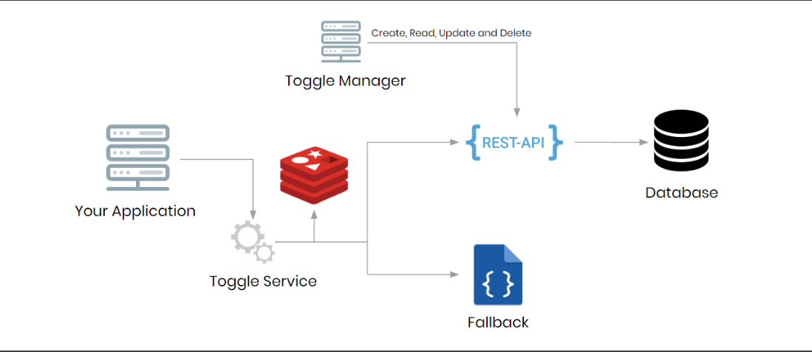
开关之类的通过界面去做 不要通过命令行去（代码和命令行容易出错）
比如redis服务挂了  可使用本地磁盘系统缓存 

### 配置管理相关的开源软件
- Apollo
- etcd
- Apache Zookeeper
- nacos


### 环境管理
- 避免知识遗失
    - 人员离职了，配置看不懂 =>> 长时间停机
- 环境修复耗时长
    - 环境构建应该能够预知 =>> 秒级构建，天级建站
- 生产测试 1 比 1
    - 线下全流程测试环境

### 环境管理要管理哪些配置？

- 环境中各种各样的操作系统，包括其版本、补丁级别以及配置设置；
- 应用程序所依赖的需要安装到每个环境中的软件包，以及这些软件包的具体版本和配置；
- 应用程序正常工作所必需的网络拓扑结构；
- 应用程序所依赖的所有外部服务，以及这些服务的版本和配置信息；
- 现有的数据以及其他相关信息（比如生产数据库）。

### Infrastructure as Code
- 用代码管理基础设施
- 能够让基础设施团队自动化复制线上环境(操作系统版本、网络配置、拓补)
- 在没有 IaC 之前，线上环境的一致要靠巡检脚本来保证

[参考链接](https://docs.microsoft.com/en-us/devops/deliver/what-is-infrastructure-as-code)

## 持续集成

### 不做持续集成的时候，世界是什么样的
- 大家开会开完了就开始各干各的，一干就是几星期
- 几星期以后要上线，发现接口变了
- 集成的流程跑不通，逻辑和商量好的不一样
- 集成的时候发现功能和需求对不上，要推倒重做
- 合代码的时候一大堆冲突


### 要先定义 Continuous-always ready to run
- 频繁发布：微服务场景的发布甚至可能每天都发布
- 自动化流程：测试，静态分析，版本管理，部署都可以做到完全自动化
- 可重复：同一个版本的服务，跑出的结果应该是不变的
- 流程快速：不应该有需要跑一整天的测试用例
- 快速问题检测与补救：出了问题，有报警，回滚以后，服务能按预期地恢复


### Continuous Integration
- 持续集成，就是在程序员 merge 代码的时候不断对代码变更进行验证
- 集成时跑单元/接口测试，如果未通过，用工作软件/邮件通知相应的开发者
- CI 流程中的测试代码保证了新代码不会破坏老的业务功能
- 保证新代码能编译通过
- 预期输入应该能够得到预期输出，不符合的结果要标红

### Continuous Integration 的一些原则
```
- 只维护一个代码仓库                        - 自动化 build    
- 对 build 进行测试                        - 每人每天要向 mainline 提交代码
- 每次提交在 mainline 上都要做 build        - 保持快速  build                    
- 在类生产环境中进行测试                     - 测试驱动开发
- 每个人都能看到进度                        - 自动化部署
- 构建失败后不要提交代码                    - merge 前要在本地/集成服务器上测试代码
- 测试通过后再继续工作                      - 下班前构建必须处于成功状态
- 能够时刻回滚到上一个版本                  - 回滚前要定修复时间
- 不要将失败的测试注释掉                    - 为自己导致的问题负责

```

### Continuous Delivery
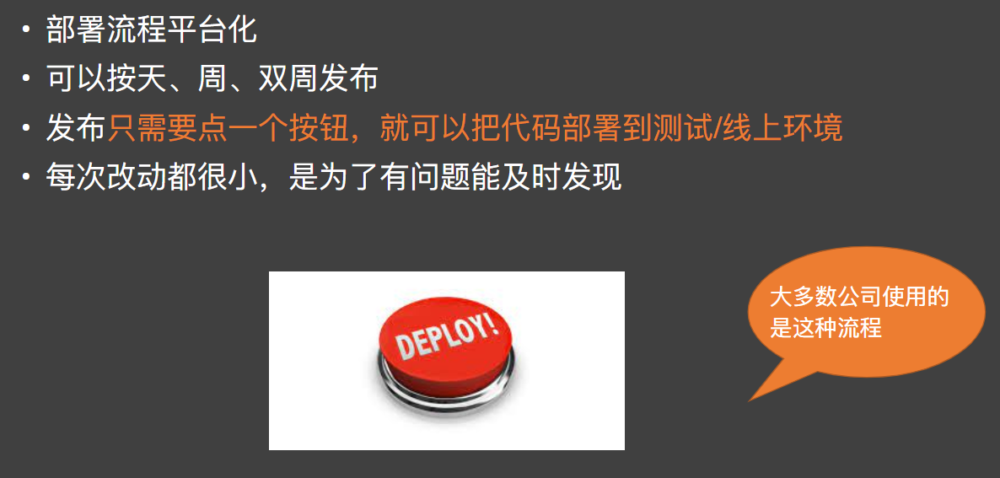


### Continuous Deployment
和 Continuous Delivery 唯一的区别：
•发布是否需要人来介入，就是点那一下按钮
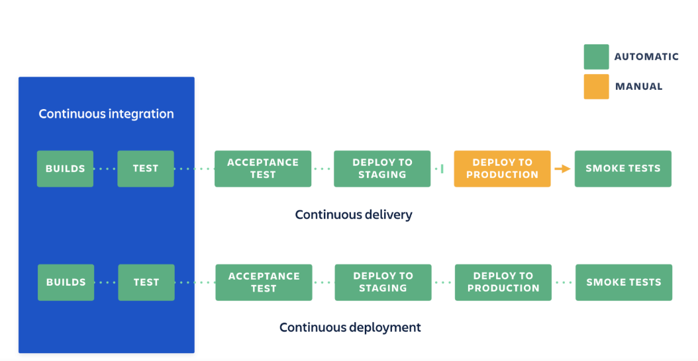

### Continuous Delivery/Deployment
- 每次提交都要触发构建
- 每次构建触发单元测试
- 每次构建触发代码静态分析
- 可视化并监控构建与测试过程
- 有失败立即报告
- 第一优先级修复构建失败

## 开源项目的 CI  github action
[ github action](https://docs.github.com/en/actions/reference/workflow-syntax-for-github-actions)

### Github Actions
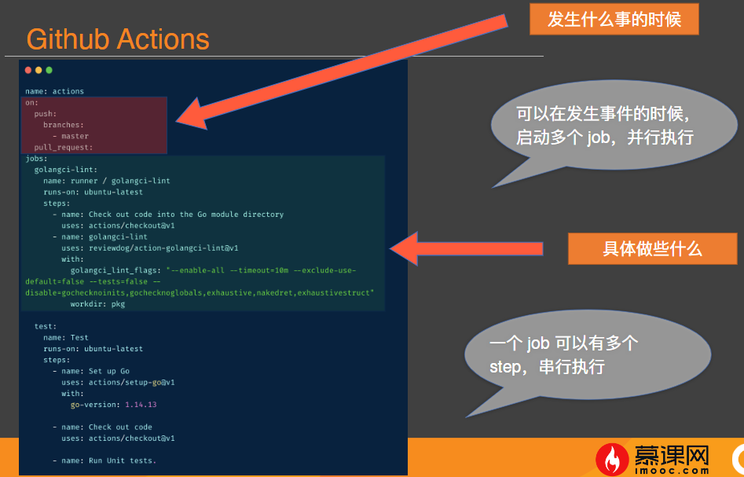

定时任务
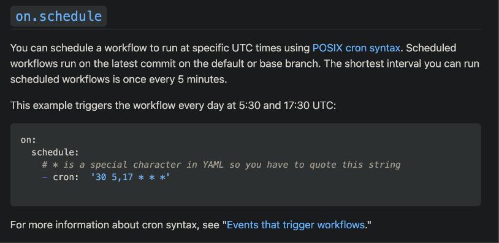

部署到云平台
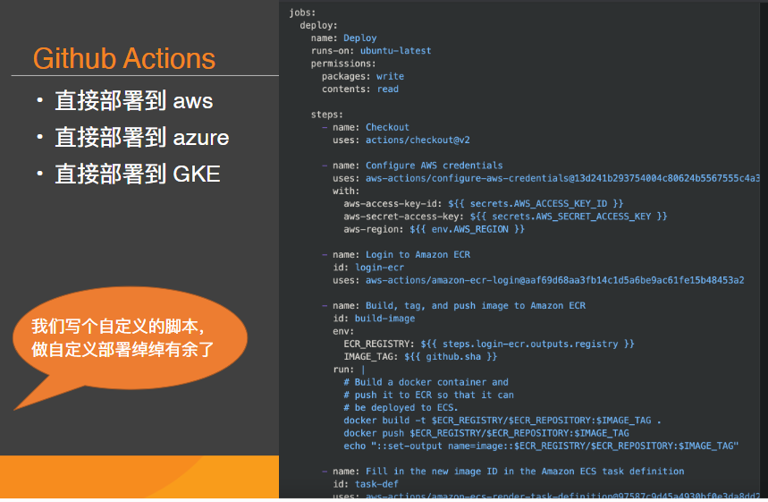


## 作业
•必做：•给自己的开源项目配置 reviewdog 的 Github Action

## References
Continuous Integration vs Continuous Delivery vs Continuous Deployment
https://learning.oreilly.com/library/view/continuous-integration-vs/9781492088943/cover.htmlhttps://www.atlassian.com/continuous-delivery/principles/continuous-integration-vs-delivery-vs-deployment

业务开关管理
https://itnext.io/things-to-think-before-enabling-feature-toggle-in-your-application-91880373a0ed


腾讯的 CI/CD 平台：
https://blog.csdn.net/weixin_37098404/article/details/102706524

Github Action 文档：
https://docs.github.com/en/actions/reference/workflow-syntax-for-github-actions