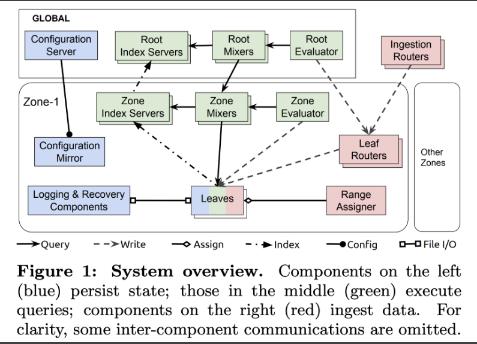
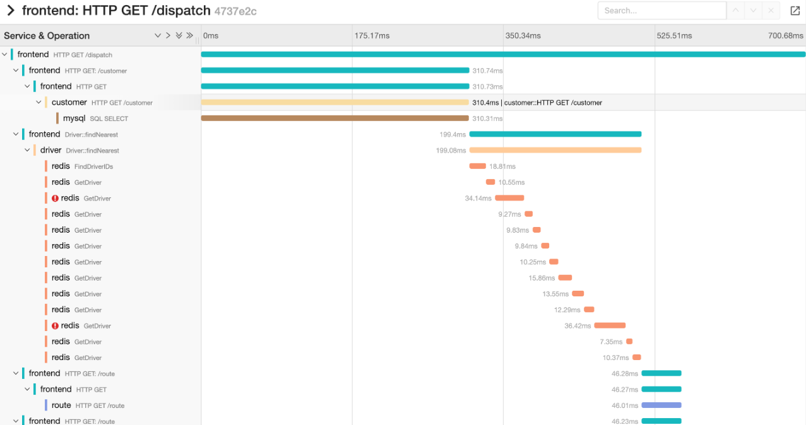

# 微服务的监控与可观测性

## 可观测性的三大主题
- Metrics
- Tracing
- Logs

## Metrics

### Pull or Push?
- Prometheus 是 Google 的 borgmon 的社区对应版
- Prometheus 主要是拉模式，pushgateway 除外
- 不少 metrics 系统是推模式

### Prometheus 架构
Push gateway  
Alertmanager
都是独立的组件

### Prometheus 基础
- 集成 client
- 很简单
- 对外暴露 http 接口

#### Client 端的 metrics 数据如何暴露出来
只要访问用户模块的 http 接口，就可以拿到这些 metrics 数据

#### Server 端配置
- 每 15s 爬应用的 /metrics
- 每 15s 执行规则，报警
- Alertmanager 配置
- 外部 targets 配置

[desc](https://prometheus.io/docs/prometheus/latest/configuration/configuration/)

### Metrics 分类

### Server 的 scrape 核心代码
在 goland 里跟踪一下流程，就是一个简单的 http Get

### Prom 本身的可用性问题
- Prometheus 是单机服务，官方的分布式方案接受度不高
- 官方提供了 remote_write 和remote_read，支持将 metrics 写到外部存储，所以可以在prometheus 后挂外部存储

### Thanos && Cortex

### Google 的 Monarch
- Pull -> Push
- In memory TSDB
- 不同的 zone 有自己的leaves 负责存储和查询
- Global 负责跨 zone 查询
- Ingestion 部分有相应的负载均衡算法

[时序数据库 | Monarch: 谷歌的全球级内存时序数据库](https://mp.weixin.qq.com/s/JUxZGF0q69HcF1uCit9TYw)

#### Metrics 常⻅的性能问题
- 性能优化一节我们已经讲过了
    - 全局锁 —>  锁拆分
    - 同步发送 —> 异步
    - 单条发送 —> batch

## Tracing

Dapper 简介

### Trace 系统

## Logs
### 常⻅日志库
- Logrus（老牌）
- Zap（性能好）
- Zerolog（性能好）

特点
- 要求用户直接指定输入字段类型
- 避免 interface 参数导致逃逸
- 减少/避免反射

[awesome-go](https://github.com/avelino/awesome-go#logging)

### 日志经常是性能问题的重灾区
- 同步日志 -> 异步（业务允许日志丢失的情况
- 单条 -> 批量
- 尤其注意 for 循环中的日志
- 警惕 fmt.Sprintf

### Elastic 生态
- 大多公司只使用 kibana 和 es

### ClickHouse
- ES 存储成本比较高
- 有些日志不做检索，只用一些固定的 id 字段查询，如 traceid

https://developer.51cto.com/art/202010/628359.htm

## Open Telemetry
### OpenTracing vs OpenCensu

### OpenTelemetry
- metrics，trace，log 分别有自己的 agent 来做收集和计算
- 没有统一的标准和规范
- 基于用户自觉的规范非常脆弱
- 三者被收集到存储之后，数据之间的关联很难建立

- 由 oltp 的 collector 统一进行处理
- Trace 和 metrics 可以由 collector 统一定关联标准(比如 k8s 的同一个 attribute)，不易出错
- Log 的历史包袱很重，当前设计者们还没想好怎么做

### OpenTelemetry 的现状
- Traces 现在 RC1
- Metrics 开发暂停
- Logs 优先级 P2，还没开始

## References

OpenTracing vs OpenCensus
https://goframe.org/pages/diffpagesbyversion.action?pageId=7296635&selectedPageVersions=11&selectedPageVersions=12

为什么从 elasticsearch 迁移到 clickhouse
https://developer.51cto.com/art/202010/628359.htm

可观测性三大范畴
https://www.dynatrace.com/news/blog/how-to-get-the-answers-you-deserve-using-the-three-pillars-of-observability/

分布式系统可观测性
https://learning.oreilly.com/library/view/distributed-systems-observability/9781492033431/ch04.html#idm45853267344488

Google 的新监控 Monarch
https://www.vldb.org/pvldb/vol13/p3181-adams.pdf

Monarch 论文的翻译
https://mp.weixin.qq.com/s/JUxZGF0q69HcF1uCit9TYw
