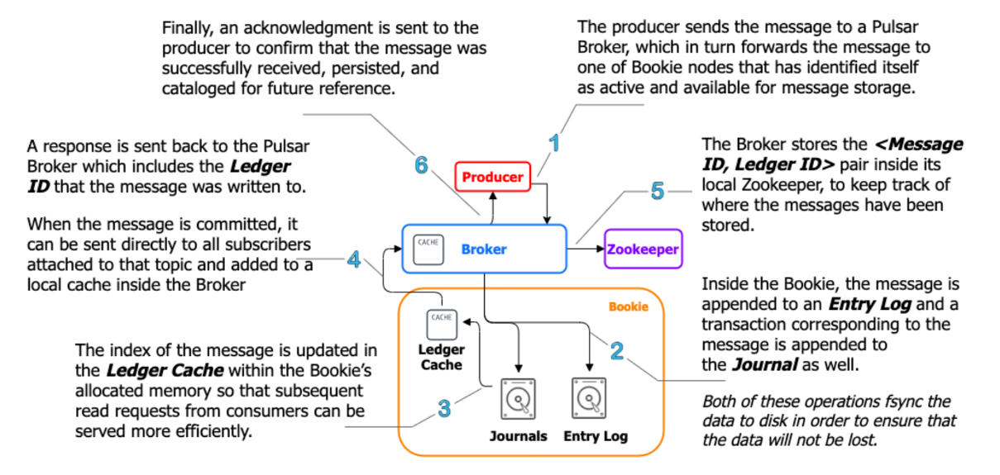

# 微服务基础设施 - 服务发现、检索、定时任务、MQ

## 服务发现

### 服务发现，why?

- 服务拆开了
- 互相之前不知道在哪
- 只知道名字


### 服务发现分类

```html
•服务端服务发现(server side discovery)
•LB 订阅服务列表，动态更新
•对远程服务调用都要走 LB

•优点：
    •客户端实现简单
    •注册中心只服务网关，压力小

•缺点：
    •LB 在核心链路上，稳定性⻛险高
```


```html
•客户端服务发现(client side discovery)
•很⻓一段时间的主流
•通过 registry 获取其它服务的信息
•客户端负载均衡


•优点：
    •核心请求链路去中心化
•缺点：
    •客户端服务，需要跨语言的SDK
    •考虑到 PHP 类脚本语言，本机可能还需要 agent
    •服务注册中心压力大
```


### 注册中心


### DNS 还是注册中心？

```html
•DNS 是在 internet 场景已经验证过的技术，可以支持海量的节点(Google 的一个数据中心有 200w 节点)

•DNS 的访问过程是一个多级缓存的搜索过程

•SRV 记录可以返回名字对应的 ip + port

•注册中心有很多形成的轮子，consul，eureka，nacos
•经过多年的微服务布道，大家更习惯通过心跳/lease 机制为服务保活的理念
•2021 的最新数据，consul 可以支持 1/2s 更新 17w 实例信息
```

https://cloud.tencent.com/developer/article/1391525

## 全文检索

### 企业内的全文检索需求

```html
•网约⻋场景：
    •客户电话投诉，在⻋内被辱骂，有录音关键字为证
    •客服按照在录音转换出的聊天记录中搜索关键字

•电商场景：
    •最近想穿花哨点，买件国⻛T恤

•微信读书：
    •写议论文，需要找找书里对拿破仑的一些论断

```

### Elasticsearch-基本概念


https://www.elastic.co/cn/blog/every-shard-deserves-a-home

- 新写入的 doc 数据是缓存在buffer 里的
- 当经过 refresh_interval 之后，buffer 里的数据会被 flush，成为一个 lucene segment，这时用户就可以查到数据了

#### Elasticsearch-数据删除

- 因为 segment 是不可变，所以删除，其实是写一个 delete 的doc 进去，带上原始的 id 和一个更新的版本号
- 在查询时，取同一个 _id 更新的版本号的数据，发现是delete，则不返回该条 doc


#### Elasticsearch-事务日志

- 如果在 buffer flush 之前就断电，那用户的数据就丢了，所以 es 支持以translog 的形式对数据修改做持久化
- 可以根据性能需要调整相应的durability 配置：fsync、async•和其它存储产品的 wal 日志类似


#### Elasticsearch-扩容

```html
•老版本的扩容缺陷
    •加了十台机器
    •总共只有 5 个 shard
    •难搞

•新版本(6.8 开始)支持 shard split
    •5 → 10 → 30 (split by 2, then by 3)
    •5 → 15 → 30 (split by 3, then by 2)
    •5 → 30 (split by 6)
```

#### Elasticsearch-未涉及

```html
•基本使用
•和 kibana 集成
•从 MySQL 同步数据
•SQL 查询等
```

## 定时任务

### 常⻅的 cron 业务场景

- 大数据平台，每小时导日志到 hive(按小时分 partition)。
- 运营场景，定时开始的活动，如 20:00开始抢购。
- 客诉场景，五分钟扫一次 MySQL 表补偿用户优惠券。
- 反作弊，15 分钟扫描一次全量用户在线状态

### 单机的 cron 服务


#### 单机的 cron 服务-单点故障


### 分布式 cron 服务


https://sre.google/sre-book/distributed-periodic-scheduling/


- Google 的 Cron 任务的执行数量分布


### 相关的可参考软件与基础设施


## 消息队列

### 和 once 有关的三个术语

```html
•At most once：最多一次，只要收到一次就一定不会再发送，如果consumer 在处理消息过程中 crash，该消息便丢失。
•At least once：至少一次，消息一定会被 consumer 消费到一次，但个别情况下可能会出现重复，需要 consumer 端注意幂等。
•Exactly once：精确一次，consumer 端一定会收到消息，且消息不会重复，不会丢失。

端到端的 exactly once 难以实现
```

### 事务消息

```html
•当前事务消息有两种：
    •RocketMQ 式：db 操作和 mq 消息保证一起成功或一起失败
    •Kafka 及其它：多条 mq 消息保证一起发出，或一起失败

虽然都管自己叫 transaction message，但本质是不同的。使用时也要注意差别。
```

### 事务消息的折衷方案

- 用户自己将要发到 MQ 的消息存储在 MySQL 中
- 收到 MQ 的 ack 后，将 ack 更新到相应的表字段
- 后台线程定时扫描未发送成功的消息，尝试重发

相比 MQ 支持的事务消息，不依赖特定基础设施，在 MQ 不支持事务消息时可以使用该方案。

### 延迟消息

- Producer 发出的消息要等待指定时间后，consumer 才能收到


### 使用场景

```html
•异构存储复制数据(replication)，mysql binlog 复制到 clickhouse 做olap，或复制到 es 做检索(这里也可以尝试阿里的开源项目 datax)
•业务流程与计算解耦(流量漏斗计算、运营指标计算、反作弊)
•交易数据同步(事务消息)
•削峰填谷(大规模推送场景)
•延时消息(如外卖晚送到 xx 分钟，补偿红包 xx 元)
```


### 常⻅ MQ 及大致原理-kafka


- Producer 在每个 partition 后追加写


- Consumer 记录每个 partition 的读 offset


- Consumer 或 partition 增加时，会有 rebalance，该操作会使 consumer 收到的消息重复。At least once

- Consumer 数 > partition 数时，多出来的consumer 会空闲

### 常⻅ MQ 及大致原理-pulsar

```html
•Pulsar 是一套存储与计算分离的架构
•Broker 是计算层，类似 “proxy”
•BookKeeper 是存储层
```


```html
•每个 topic 都是一个 segment 的集合
•每个 segment 中可以放 50000 条消息
•一个 segment 满时，会创建新的segment
•Topic 可以包含无数个 segment
```


```html
•真实的架构更复杂
•Zk 中管理 topic，schema，broker 的各种元数据
•如果使用 pulsar proxy，服务则会有多层
```


```html
•一个 topic 对应一个 managed ledger
•一个 managed ledger 有多个 bookie 的 ledger(segment) 组成
```


### Producer 的生产流程-较复杂，建议感兴趣的同学自行学习



### Pulsar 的优势与劣势

```html
•优势：
    •存储与计算分离
    •功能丰富
    •扩容方便
    •在腾讯的支付场景经过了验证

•劣势：
    •架构复杂，组件多，运维成本高
    •相比 kafka 更新，材料少，系统学习的资料也少
    •碰到坑不一定好解决
```

## References
Pulsar vs Kafka

https://www.section.io/engineering-education/breaking-down-kafka-vs-pulsar/

https://digitalis.io/blog/technology/apache-kafka-vs-apache-pulsar/

https://streamnative.io/en/blog/tech/2020-07-08-pulsar-vs-kafka-part-1/

Hashicorp 的 consul 性能测试，1/2s 更新 17w 节点信息

https://www.hashicorp.com/resources/scale-testing-network-control-plane-inside-consul-global-scale-benchmark

海量节点时的 consul 优化

https://medium.com/criteo-engineering/configure-consul-for-performance-at-scale-f6a089706377

dkron，参考 Google 的 cron 论文实现的分布式 cron 系统

https://github.com/distribworks/dkron

K8s 的 cronjob 文档

https://kubernetes.io/zh/docs/tasks/job/automated-tasks-with-cron-jobs/

数人云的 Google 服务发现介绍

https://cloud.tencent.com/developer/article/1391525

Google 的 cron 系统设计

https://sre.google/sre-book/distributed-periodic-scheduling/

Elasticsearch 的架构科普

https://www.elastic.co/cn/blog/every-shard-deserves-a-home

## 作业

使用https://github.com/olivere/elastic完成 MySQL 的数据导入到 elasticsearch 中的需求。

必做：
MySQL 有一张表，你要把 MySQL 的数据插入到 elasticsearch 里，并且能够搜索得到，提供 API。

选做：MySQL 有一张表，并且会实时更新。你需要把更新的数据在 elasticsearch 中也能查询到。MySQL -> Binlog  -> kafka -> consumer -> elasticsearchEs —> query -> keyword -> 搜索结果

作业目的：了解企业中的异构数据同步技术栈，日常工作碰到类似场景可以给出解决方案不用提交