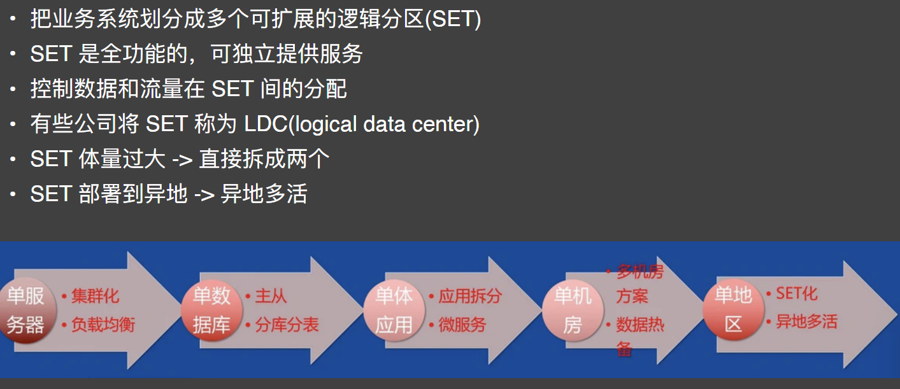

# 大型互联网公司的稳定性密码

## 稳定性, 事前

### 发现了问题才能解决

- 八股文流传太多，大家容易忘记问题的本质，只记忆结论性的东⻄
- 直接去背限流熔断降级，你就掉坑里了
- 先有问题，才是去解决问题

问题

- 机器坏了
- CPU 100% 了。。。
- OOM 了。。
- 磁盘 IO 满了
- 网络抖了

### 容量评估

- 根据过往情况评估业务系统性能指标、容量指标
- 国内做的好的某巨头公司，大促期间的系统性能监控数据都是会保留的，最近几个月的监控数据也是保留的
- 监控数据会为扩容需要加多少台机器提供一定参考

### 链路梳理

- 当前业务的流程依赖哪些服务？
- 哪些服务是强依赖，哪些是弱依赖？
- 外部弱依赖出故障时，是否能够不影响本服务？
- P0 级别的服务，不应该依赖 P2 级的服务

### 监控

- runtime.Memstats(prometheus client 中自带)
- 接口 p99，依赖方延迟(包括数据库)
- 内存 RSS 用量
- CPU 用量
- 连接数，tcp_retrans
- 业务日志，业务指标监控
- Panic 日志监控
- etc

### 报警

- Goroutine 数量超限报警
- p99 超 SLA 报警
- 内存 RSS 超水位线报警，OOM 报警
- CPU 用量报警
- 业务指标异常报警
- Panic 报警
- Supervisor 的 stderr 日志中的 fatal 报警
- etc

### 全链路压测

- 流量入口：流量染色，染色标识透传
- 压测日志：shadow 目录
- 数据库：shadow 表(在 sql 中可以使用 /* comment */ 透传给 mysql 中间件压- 测信息)
- 缓存：同数据库
- 第三方服务：压测流量来时要降级
- MQ 消息：下游不消费压测消息
- 大数据生态：不采集压测相关的任何数据

#### 全链路压测-一些注意点

- 压测数据不要污染生产数据
- 模拟真实用户行为
- 逐步加压
- 全链路关键系统上都应有人对压测跟进
- 常态化
- 需要有压测大盘与压测报告
- 对压测中体现出的问题要复盘和改进

### 预案系统

- 大促期间会将很多边缘服务进行降级
- 影响性能的不重要功能会被关闭
- 开关实在太多，人为管理难以为继

### 巡检系统

- 机器配置不一致？
- 十万台规模的机器，配置下发都成功了吗？
- 每一个预案都正确执行成功了吗？

其实就是在每台机器上都可以执行一个脚本，脚本可以检查：

- 下发的配置项
- 接口的返回值
- 文件/日志的内容

### 系统优化

- 节省 CPU：
    - 节省更多的机器
- 节省内存：
    - 节省更多的机器
- 在线/离线任务混部：
    - 节省更多的机器
- 提高集群资源利用率：
    - 节省更多的机器

## 稳定性, 事中

### 压测监控

- 压测期间显示关键链路上的服务的核心指标：CPU，mem，latency，连接数等
- 有问题自动突出显示
- 核心链路服务返回大量错误时自动终止

### 限流-漏桶(leaky bucket)

- 匀速流出
- 用于一些“整流”场景

### 限流-令牌桶(token bucket)

- 固定桶大小
- 匀速填充
- 支持一定程度的 request burst

### 限流-填充策略

- 瞬时填充匀速填充

- 匀速填充

### 限流-warmup

- 系统⻓期低水位，突发高流量，容易把系统直接打死

### 熔断

- 限流是对服务自身的保护
- 熔断则既保护自身，也一定程度保护了外部服务

https://sentinelguard.io/zh-cn/docs/golang/circuit-breaking.html

### 自适应限流

- 传统的限流需要给每个接口配置规则
- 复杂系统靠程序员很难评估合理的限流原则
- 系统在开发过程中会不断变化

- 我们可以选择指标来对系统进行自适应限流

### 重试策略

- 一次请求最多重试三次
- 每个 client 重试和请求的比例要低于 10%
- 通过请求次数与重试次数建立如右边的直方图，来帮助后续请求判断系统整体负载
- 若过载，返回 overload 错误码

https://sre.google/sre-book/handling-overload/

## 稳定性, 事后

### 稳定性复盘

- 压测中哪些系统有性能问题
- 记录 TODO，排期尽快修复
- 如果是紧急事件，是否可以通过业务开关进行临时绕过
- 将可以绕过的问题记录在预案平台中

## 其他稳定性保障机制

异地多活
    - 当前有不少互联网中型公司的高可用是在吹牛逼
    - 不同的业务场景，对于可用性的要求是不一样的
    - 下面的应用，哪些服务挂了会对你的日常生活造成重大影响

真正的异地多活

### 流量回放系统

### 混沌工程

- 不相信研发人员吹的牛逼
- 主动在线上纵火

工具：
    - ChaosBlaede
    - Chaos Mesh

### 红蓝攻防演练
攻击方：
    - 在线
    - 实时
    - 无差别
    - 突袭

防御方：
 -自适应容灾
 -防抖

### 断网演练

### 单元化架构/set 化架构/bulkheads 模式

https://www.infoq.cn/article/edktgbzgi9q13dczo50a

### 支付宝架构

https://help.aliyun.com/document_detail/186328.htm?spm=a2c4g.11186623.0.0.5adf69catqZzc1#topic-2026783

### 大公司的机制保障

https://help.aliyun.com/document_detail/186328.htm?spm=a2c4g.11186623.0.0.5adf69catqZzc1#topic-2026783

## References

稳定性图来源：
https://zhuanlan.zhihu.com/p/54538457

全链路压测的一些关键点：
https://lishoubo.github.io/2018/07/15/%E5%85%A8%E9%93%BE%E8%B7%AF%E5%8E%8B%E6%B5%8B%E7%9A%84%E5%A4%A7%E6%A6%82%E6%80%9D%E8%B7%AF/

阿里的全链路压测分享:
https://t.cj.sina.com.cn/articles/view/1939498534/739a662601901022n

https://blog.csdn.net/ilfrost/article/details/116828941?spm=1001.2014.3001.5501

大促稳定性保障：
https://chowdera.com/2020/11/20201116232434188w.html

单元化架构：https://help.aliyun.com/document_detail/186328.htm?spm=a2c4g.11186623.0.0.5adf69catqZzc1#topic-2026783

美团的 set 化架构分享：
https://www.infoq.cn/article/edktgbzgi9q13dczo50a

## 作业

必做：
阅读 Google SRE 运维解密 21，22 章

选做：阅读《High-Availability at Massive Scale: Building Google’s Data Infrastructure for Ads
