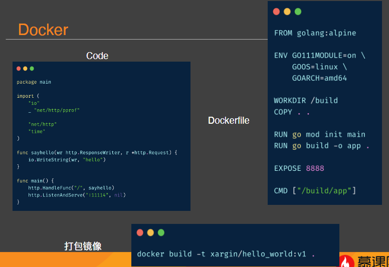

# Cloud Native Go

## 云原生与 12 factor(因素)

### 什么是云原生-Pivotal 旧版

1. 2015 年 Pivotal 的 Matt Stine 写的《迁移到云原生架构》
    * 探讨了几个主要特征：
        * 符合 12 factor 的应用
        * 面向微服务的架构
        * 基于 API 的协作
        * 抗脆弱性

[云原生（Cloud Native）的定义](https://jimmysong.io/kubernetes-handbook/cloud-native/cloud-native-definition.html)

### 什么是云原生-CNCF 旧版

到了 2015 年 Google 主导成立了云原生计算基金会（CNCF），起初 CNCF 对云原生（Cloud Native）的定义包含以下三个方面：

* 应用容器化
* 面向微服务架构
* 应用支持容器的编排调度

### 什么是云原生-新版

* 公有云、私有云、混合云
* 构建可弹性扩展的应用
* 代表技术：容器、服务网格、微服务、不可变基础设施、声明式 API
* 容错性好、易于管理、便于观察的松耦合系统
* 可靠的自动化手段
* 工程师能够轻松地对系统做出频繁和可预测的重大变更
* 厂商中立的开源生态系统

(云原生的战⻋上绑上了越来越多的利益相关方)

### 12 factor(因素)

* *I. 基准代码一份基准代码，多份部署
* *II. 依赖显式声明依赖关系
* *III. 配置在环境中存储配置
* *IV. 后端服务把后端服务当作附加资源
* *V.  构建，发布，运行严格分离构建和运行
* *VI. 进程以一个或多个无状态进程运行应用
* *VII. 端口绑定通过端口绑定提供服务
* *VIII. 并发通过进程模型进行扩展
* *IX. 易处理快速启动和优雅终止可最大化健壮性
* *X. 开发环境与线上环境等价尽可能的保持开发，预发布，线上环境相同
* *XI. 日志把日志当作事件流
* *XII. 管理进程后台管理任务当作一次性进程运行

#### 基准代码

* 一份代码
* 多种环境

#### 依赖

#### 配置

* 环境类(如 prod，dev，staging)的配置，使用环境变量管理•配置分组(按环境分组也可以)

[参考链接](https://12factor.net/zh_cn/config)

#### 后端服务

* 后端服务统一抽象成外部资源
* 外部资源切换时，只需修改一行代码/配置

#### 构建、发布和运行

* 构建阶段：是指将代码仓库转化为可执行包的过程。构建时会使用指定版本的代码，获取和打包依赖项，编译成二进制文件和资源文件。
* 发布阶段：会将构建的结果和当前部署所需配置相结合，并能够立刻在运行环境中投入使用。
* 运行阶段：（或者说“运行时”）是指针对选定的发布版本，在执行环境中启动一系列应用程序进程。

#### 无状态进程

* 一个或多个进程运行
* 无状态无共享，持久化数据在数据库中
* 反对 sticky session

#### 端口绑定

* 通过绑定端口提供服务

#### 并发

* 通过进程模型进行扩展
* 需要提高服务能力，只要增加无状态的进程数就可以
* 借助 systemd 之类的工具管理 stdin, stdout 和崩溃输出

#### 易处理

* 进程可以快速起动停止
* 处理 sigterm 优雅中止
* 客户端丢失连接后主动重连
* 底层设施崩溃时进程仍然要保持健壮(不能一崩不起)

#### 开发环境与线上环境等价

* 尽可能保持开发、预发布、线上环境一致(不能线下依赖 mysql，线上依赖 oracle，不能线下 Go 1.17，线上 1.14)
* 持续部署
* 更广义的环境一致是很难做的，想想 Lyft 的例子

#### 日志

* 把日志当成事件流
* 日志收集、分析系统
* 计算图形化，系统化
* 根据事件流报警

#### 管理进程

* 一次性管理进程：如数据库的 migration，应该与线上服务使用相同的环境
* 所有类型的进程依赖管理环境应该一致(比如 py 用 pyenv，其它语言没法用)

## 云原生设计理念/模式

### 设计理念

* 面向分布式设计（Distribution）：容器、微服务、API 驱动的开发；
* 面向配置设计（Configuration）：一个镜像，多个环境配置；
* 面向韧性设计（Resistancy）：故障容忍和自愈；
* 面向弹性设计（Elasticity）：弹性扩展和对环境变化（负载）做出响应；
* 面向交付设计（Delivery）：自动拉起，缩短交付时间；
* 面向性能设计（Performance）：响应式，并发和资源高效利用；
* 面向自动化设计（Automation）：自动化的 DevOps；
* 面向诊断性设计（Diagnosability）：集群级别的日志、metric 和追踪；
* 面向安全性设计（Security）：安全端点、API Gateway、端到端加密；

#### 弹性设计-AutoScaling

* ASGAverageCPUUtilization—平均 CPU 使用率
* ASGAverageNetworkIn—网卡平均接收字节数•ASGAverageNetworkOut—网卡平均发送字节数
* ALBRequestCountPerTarget—每个实例完成的平均请求数

* 超过阈值自动扩容
* 低于阈值自动缩容
* 最小可用实例
* 最大扩容实例数

#### 安全性设计

* Service Mesh 数据面，如 envoy，mosn：TLS 双向加密。
* Service Mesh 控制面，如 istio：证书管理，证书下发，服务认证。
* 身份管理服务，比如 Google Cloud 上的 Anthos ID Service：二进制文件验证，部署时安全检查
* 配置规则验证：按照安全，业务性质，合法性对配置变更进行校验
* 云节点加固：系统软件签名认证(secure boot)，完整性验证(integrity verification)
* 安全容器，Sandbox 技术：工作负载隔离(典型项目，如 katacontainer，gvisor)

## K8s 基础

### Docker

* 线上线下运行环境的不一致会导致相当多的 bug
* 没有 docker 之前，我们会有各种各样的环境问题，比如：python 2.x，python 3.x，为了解决这些问题还有专⻔的 pyenv 一类的工具
* PHP 与 python 问题类似
* Linux 在 2.6 引入 cgroup 技术，实现了轻量级的资源隔离

#### Docker Hub && registry

### K8s && Docker

### K8s-基本组件

* Image registry : 存放 docker 镜像的系统
* Node : 虚拟机或物理机
* Container Runtime：OCI 定义了一套规范，只要遵守规范，任意的容器实现都可以用，docker 是其中之一
* Pod：“容器组”，是 k8s 集群中调度的最小单位
* Kubelet：每个 node 上都有的一个 agent，负责从 api server 获取任务，本 node 内的 pod 管理，健康检查，容器监控
* Service：k8s 内置的对微服务的抽象，一般包含多个 pod
* Kubeproxy：定义网络规则，实现 k8s 内置的 service 流量截持

### K8s-其它概念

* Stateful Set：有状态节点，名字固定，id 连续，滚动升级，大多用于存储类系统上云，如 MySQL，mongo
* Ingress：集群的入口，一般是 nginx，caddy 之类的网关
* DaemonSet：每一个 node 上都跑一个的守护进程
* Job：一次性任务，比如 xx 活动后跑个临时任务算一下数据
* Cron job：定时任务

### Minikube

## References

Consul 集成到 minikube：

https://learn.hashicorp.com/tutorials/consul/kubernetes-minikube

Minikube tutorial：

https://minikube.sigs.k8s.io/docs/start/

应用是如何在 k8s 上运行的：

https://thenewstack.io/how-do-applications-run-on-kubernetes/

云原生定义：

https://jimmysong.io/kubernetes-handbook/cloud-native/cloud-native-definition.html

Google 的 zero trust 科普：

https://cloud.google.com/blog/products/identity-security/applying-zero-trust-to-user-access-and-production-services

AWS 自动扩缩容

https://aws.amazon.com/cn/autoscaling/

AWS 自动扩缩容可选指标：

https://docs.aws.amazon.com/autoscaling/ec2/userguide/as-scaling-target-tracking.html#available-metrics

## 作业

必做：  
使用 docker hub 发布自己的 hello 服务使用 minikube 将代码打包成为 deployment，并发布为 service在本机访问 minikube 中的服务(提示：minikube tunnel 或 service 命令)

选做：  
在 minikube 中集成服务发现，打通服务间调用(提示，默认的服务发现可以通过 env 找到其它服务的 host 和 port；愿意选择 consul 来做也可以)在 minikube 上配置定时任务
