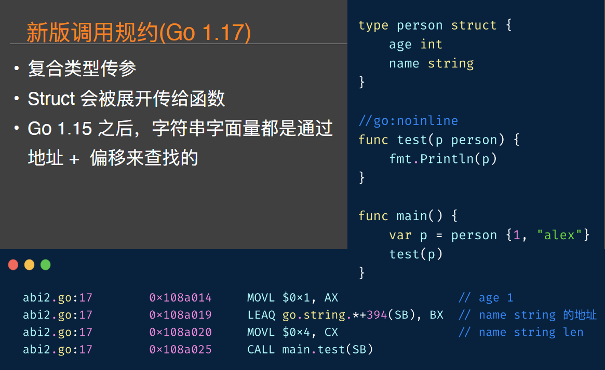

# Go 语言前沿

## ABI

### 什么是 ABI

* 参数如何传给函数
* 谁来保存/清理栈上的参数
* 返回值放在哪里
* 异常如何弹出

### Go 语言的调用规约

* 参数和返回值都在栈上
* 由 caller 提供参数和返回值的栈空间
* 在 callee 中获取参数时，使用 FP 伪寄存器(实践结果是 SP)+偏移量找到参数和返回值

### 新版调用规约(Go 1.17)

* 老规矩，用 go tool objdump

* 复合类型传参
* Struct 会被展开传给函数
* Go 1.15 之后，字符串字面量都是通过地址 +  偏移来查找的

* 浮点数传参
* XMM 寄存器(128 位)
* 专用操作指令(movdqa，movdqu 等)

### 新版调用规约-defer

* defer
* Defer 的参数还是在栈上，没大变化

### go func

* 和老版本比没变化

## 泛型

### 为什么需要泛型？

* 无法实现可复用的类型安全的数据结构
* 下面的链表中存储了不同类型的元素，在操作时一不注意就会 panic

* 减少代码重复，看看我们之前⻅过的这张图

### 社区里的泛型实现尝试

* genny：通过文本替换实现泛型

### 泛型使用

* *Go 1.17
* *-gcflags=-G=3

* Map

* Reduce

* Filter

* Foreach

* 三元表达式(伪

* Go 的泛型实现原理

[Go 1.17 泛型尝鲜](http://word.czqlm.top/index.php/2021/08/18/go-1-17-%e6%b3%9b%e5%9e%8b%e5%b0%9d%e9%b2%9c/)

## go mod

### go mod 文件

[goModInfo](file/goModInfo.png)

### go.sum 文件

* go.sum 详细罗列了当前项目直接或间接依赖的所有模块版本，并写明了模块版本的 SHA-256 哈希值，防止项目依赖被篡改
* 类似早期 go dep 之类的 lock 文件

[goSum](file/goSum.png)

### go mod - MVS 算法

* Minimal Version Selection
* 本质是把所有依赖的版本先列出来
* 然后选择这些依赖的版本中最高的那个版本(该版本要出现在列表里)

* 具体计算方式
* 一个简单的递归算法

### go mod - semver

* v0.X.X: 对于主版本号(major)是0的情况，隐含你当前的API还处于不稳定的状态，新的小版本可能不向下兼容
* v1.X.X: 当前的API处于稳定状态，minor的增加只意味着新的feature的增加，API还是向下兼容的
* v2.X.X: major的增加意味着API已经不向下兼容了

### go mod - 依赖冲突

* 传递依赖冲突，比较难解决，可能需要 dirty work

### go mod - 私有仓库

* GOPRIVATE
* Git config insteadOf 将 https 拉取变成 git 拉取

### go mod - 不同的 goproxy 实现差异

* 官方没有开源 goproxy 的实现
* 第三方的 goproxy 实现各不相同
* 个人认为目前goproxy.cn的实现是最科学的，当有人使用goproxy.cn缓存过依赖以后，官方的 gosumdb 中也有你的库了
* 其它的几个 goproxy 实现都不是这样的

### go mod 缺陷

* 协作开发时，go.sum 文件比较容易冲突
* 因为老版本的 go.sum 总是会自动更新

#### go mod 缺陷-子命令的副作用

* Go 子命令(test，fmt 等)会自动更新 go.mod 和 go.sum
* 1.16 之后缓解了很多

#### go mod 缺陷-semver 连 Google 自己的工程师都不遵守

* semver 规范没有被很好地遵守，Google 的其它开源项目特别是gRPC，发生过不遵守 semver 修改行为的情况，社区的信任危机

[https://codeengineered.com/blog/2018/golang-vgo-semver-human-error/](https://codeengineered.com/blog/2018/golang-vgo-semver-human-error/)

#### go mod 缺陷 - 大版本发布问题

* vX path 污染了包的导入路径
* 不同版本的完全相同的数据结构(如 v1.SameStruct, v2.SameStruct)，要写很多重复的转换代码

[深入Go Module之讨厌的v2](https://colobu.com/2021/06/28/dive-into-go-module-2/)

#### go mod 缺陷-删库跑路

* 官方的 gosumdb 对外部库的缓存期限说明较模糊，可能随时被删除
* 像早期著名的 javascript leftpad 事件，在 Go 生态理论上也是可能重演的

## 一手信息渠道

### golang-nuts

* 官方论坛
* 搜不到的问题可以这里问

[https://groups.google.com/g/golang-nuts](https://groups.google.com/g/golang-nuts)

### reddit/go

* 最大的第三方 Go 交流社区
* 如果要宣传自己的开源库优先选这里

[https://www.reddit.com/r/golang](https://www.reddit.com/r/golang)

### 订阅 issues

### Proposal

[https://github.com/golang/proposal](https://github.com/golang/proposal)

## ReferencesXMM 寄存器

https://github.com/cch123/llp-trans/blob/master/part3/translation-details/function-calling-sequence/xmm-registers.md

调用规约

https://github.com/cch123/llp-trans/blob/master/part3/translation-details/function-calling-sequence/calling-convention.md

Plan9 汇编入⻔，主要看栈的图部分

https://github.com/cch123/golang-notes/blob/master/assembly.md

Go mod  的 V2 问题

https://colobu.com/2021/06/28/dive-into-go-module-2/

gRPC 破坏 semver

https://codeengineered.com/blog/2018/golang-vgo-semver-human-error/

泛型实现原理

https://colobu.com/2021/08/30/how-is-go-generic-implemented/

Russ cox 的 MVS 算法说明

https://research.swtch.com/vgo-mvs

Go mod 七宗罪

https://mp.weixin.qq.com/s/ihtvAyJLtwvAXVkBuqL8kw
