# Go 语言与未来架构

## Service mesh

### 什么是 service mesh

1. 历史：
    * Service Mesh 最早是开发了 linkerd 的 Buoyant 公司提出的
    * 2016 年 9 月 29 第一次公开
    * 国内一般译为服务网格

2. 功能：
    * 基础设施层，负责处理服务间的通信
    * 一般是一个轻量级的网络代理，作为 sidecar 与应用部署在一起

### 我们看看 API 框架需要有哪些功能

* 服务发现
* 服务间通信
* 限流
* 熔断
* 加密
* 路由
* 负载均衡
* Tracing
* 优雅重启

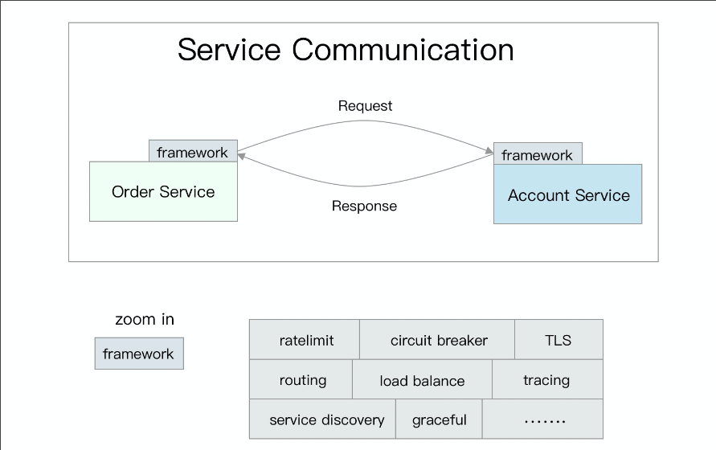

### 大公司框架模式下的开发痛点

* 框架团队和业务团队是分离的
* 框架组想升级框架需要找业务方来帮忙
* 大公司规模下的框架升级以千小时工时计
* 基础设施试点功能困难
* 语言太多，SDK 写到猝死

### Service mesh 怎么解决这些问题

* 关注点分离，框架功能下沉到基础设施
* 业务模块与流量相关功能分成了两个进程，同一个 pod，不同的container
* 基础设施团队可以自主升级自己的模块了
* 服务注册发现、流量转发、路由、熔断、加密、负载均衡算法等等功能由 mesh 模块实现

### Service mesh 基本概念-数据面和控制面

1. 数据面：
    * Envoy
    * MOSN
    * Linkerd
2. 控制面：
    * Istio


### Service mesh 基本概念-xDS protocol

* CDS (Cluster Discovery Service)
* EDS (Endpoint Discovery Service)
* LDS (Listener Discovery Service)
* RDS (Route Discovery Service)

这四个是后来新加的

* Scoped Route Discovery Service (SRDS)
* Virtual Host Discovery Service (VHDS)
* Secret Discovery Service (SDS)
* Runtime Discovery Service (RTDS)

xDS 本质上是一套规范，只要遵守该规范，控制面和数据面都可以“透明”地进行替换

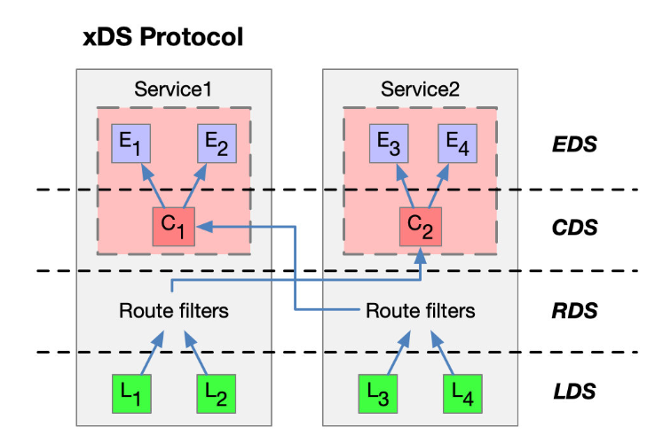

### Service mesh 劣势

* 有 mesh 前，服务间通信只有两跳，现在是六跳
* Envoy 的代码相当多且不易读，充满了 onXXX 的回调，如果碰到问题需要定位，临时读代码比较难
* iptable 做流量劫持性能低下，又需要换用 cilium 之类的方式进行优化，⻔槛高


### Service mesh 部署

* 和 app 在同一个 pod 内
* 和应用共享网络 namespace
* 接管应用与外部通信(envoy 用 iptables)
* 对业务透明


```yaml
apiversion: apps/vlbetal
kind: Deployment
metadata:
    name:service
aspec:
    replicas: 2
    template:
        metadata:
        labels:
            app: servicea
        spec:
            containers :
            - name: servicea
            image: dnivra26/servicea: 0.6
            ports :
            - containerPort:8081
                name :svc-port
                protocol:TCP
            - name: envoy
                image: envoyproxy /envoy : latest
                ports:
                    - containerPort: 9901
                    protocol:TCP
                    name : envoy-admin
                    - containerPort: 8786
                    protocol: TCP
                    name: envoy-web
```

## Mesh 数据面实现 (以 mosn 为例)

### MOSN

* 是蚂蚁金服开发的类似 envoy 的数据面
* 在蚂蚁内部大规模铺开，线上有几十万实例
* 使用 100% Go 开发，当然也遇到了很多 Go 语言本身带来的问题

### MOSN-各种衍生 mesh

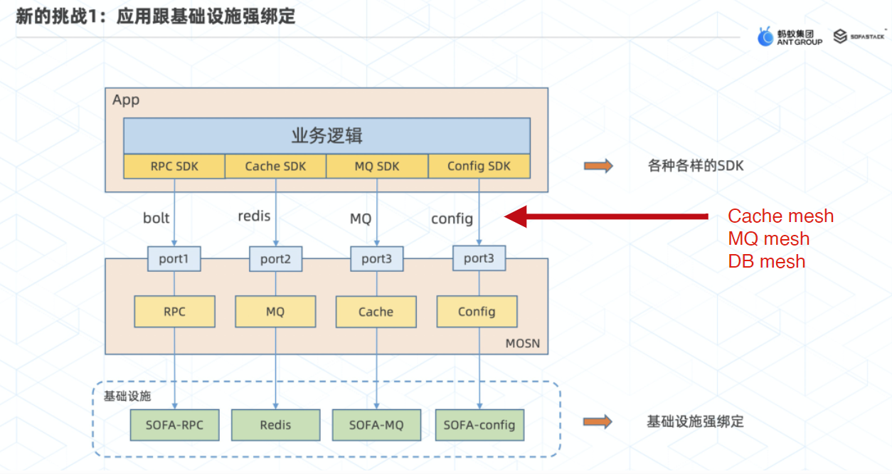

### 核心原理-请求处理流程

*MOSN 请求处理流程
*network/io 主要负责网络读写
*protocol 主要负责协议编解码
*stream 主要负责request、response等模型转发和协调
*proxy 主要负责路由等功能。

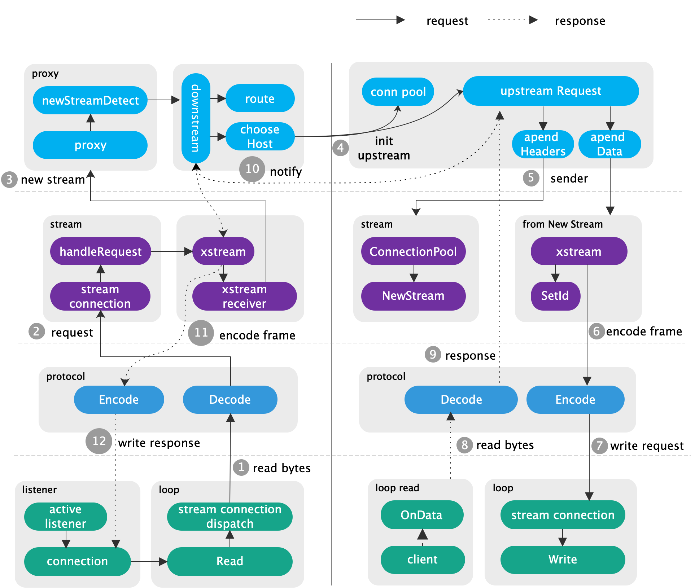

[参考文章](https://zonghaishang.github.io/2021/08/27/%E6%8F%AD%E7%A7%98mesh%E7%BD%91%E6%A0%BC%E6%A0%B8%E5%BF%83%E8%BD%AC%E5%8F%91%E6%B5%81%E7%A8%8B/)

### MOSN 核心原理-XProtocol 抽象

* 基于 TCP 的协议有 multiplex 和非 multiplex 两种
* 可以用同一套模型来编写(streamconn 抽象，Dispatch 流程)

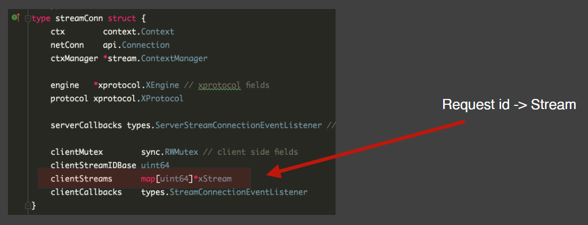

[参考资料](https://zonghaishang.github.io/2021/08/27/%E6%8F%AD%E7%A7%98mesh%E7%BD%91%E6%A0%BC%E6%A0%B8%E5%BF%83%E8%BD%AC%E5%8F%91%E6%B5%81%E7%A8%8B/)

### MOSN 核心原理-协议的 multiplex 和非 multiplex

* Multiplex 类的协议在内存里一般都需要维护 request id -> req 的映射，每个 TCP 连接对应一个 map
* 当服务端返回 resp 时，从 resp 中解析出 request id，并从 map 中获取到 req

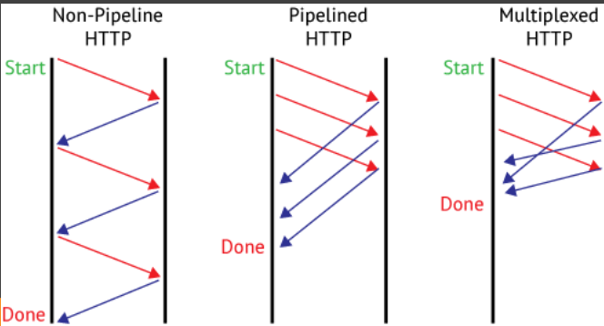

* HTTP2 支持连接上的 multiplex，一条连接可以并发发送多个请求
* 而 HTTP1 则只能等待 response 返回之后才能发送下一个请求(除非 pipeline 模式)

### MOSN 核心原理-流式协议

* HTTP 支持流式传输，在 header 中有一个 Transfer-Encoding: chunked
* 网关(nginx)往往支持 gzip 对 content 进行内容压缩，是对内容压缩一段传输一段这种模式来返回的

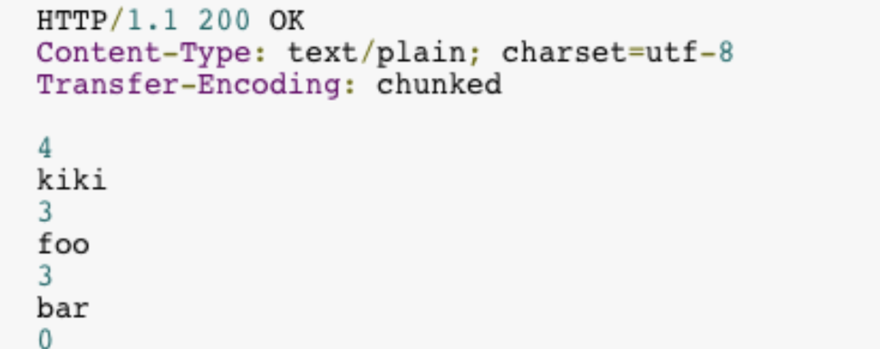

### Go 语言开发 mesh 的优势

* 比 C++ 写的更快
* Mosn 的抽象比 envoy 简单，开发协议支持可以直接复用整个框架的能力：connpool，streamconn，dispatch 流程等
* 编码阶段不用太操心内存分配释放问题

### Go 语言在大规模连接情况下的水土不服

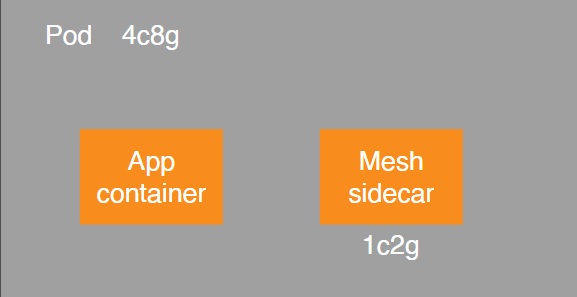

1. 又到了我们的算术时间了
    * 5w 条连接
    * 每条连接一个 goroutine
    * 每个 goroutine 有 8k 的栈

## 后端架构发展趋势

### 分布式应用的各种需求

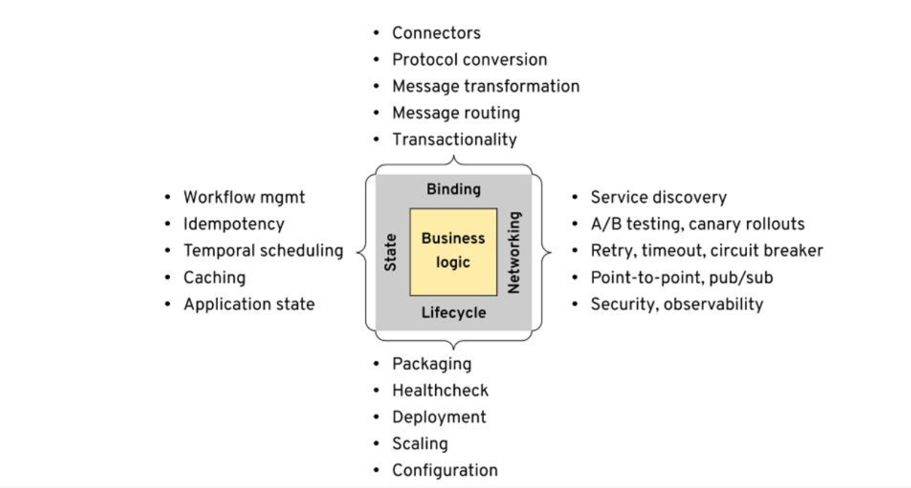

### Dapr = Distributed Application Runtime（分布式应用程序运行时间）

* 业务架构的发展趋势
* 将所有非功能需求(即和业务没关系的代码)全部下沉到 sidecar

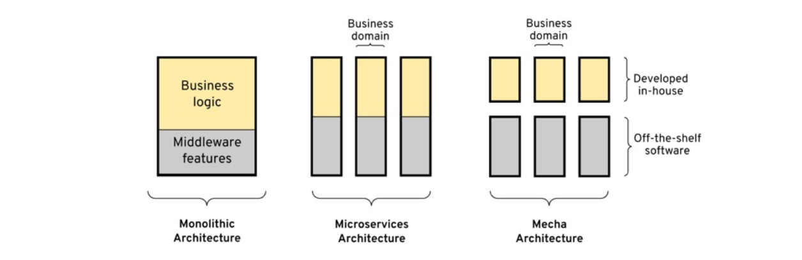

### Mecha 架构

* Binding，State，Lifecycle 和 Network 的问题分别由各自的领域软件来解决
* 业务模块里将只有纯业务代码和非常轻量的 gRPC sdk
* 其发展过程会经历下面的两个步骤：
    1. 非功能代码外移到各种 runtime 中；
    2. 外部 runtime 整合为 1-2 个具体的 sidecar

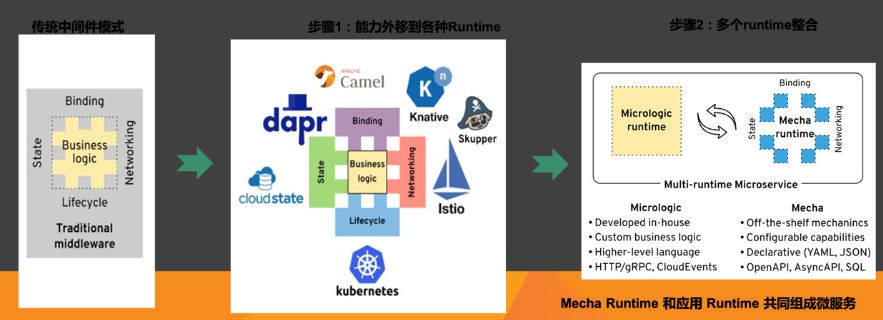

## dapr

### Dapr 对应用外部依赖进行了抽象

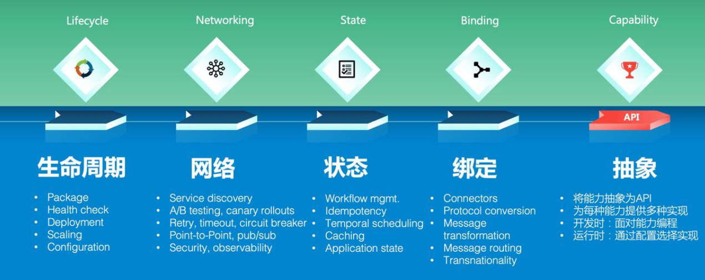

### Dapr 中的概念

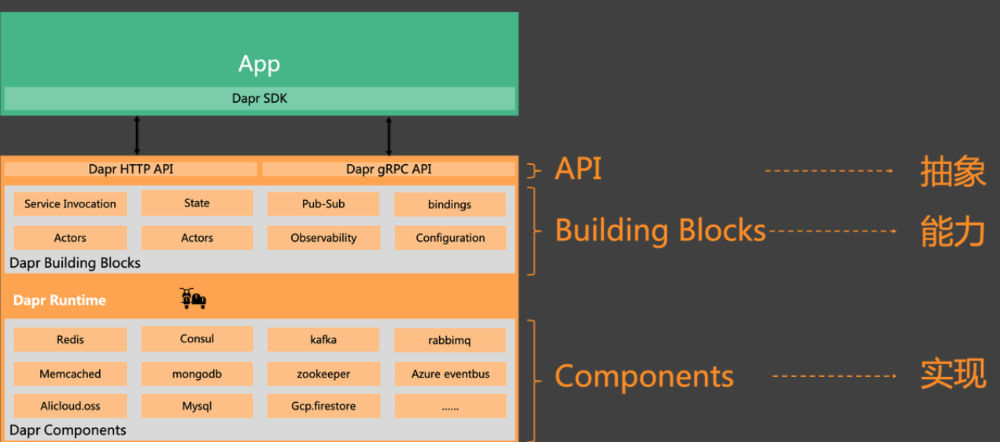

### 和 service mesh 类似的控制面

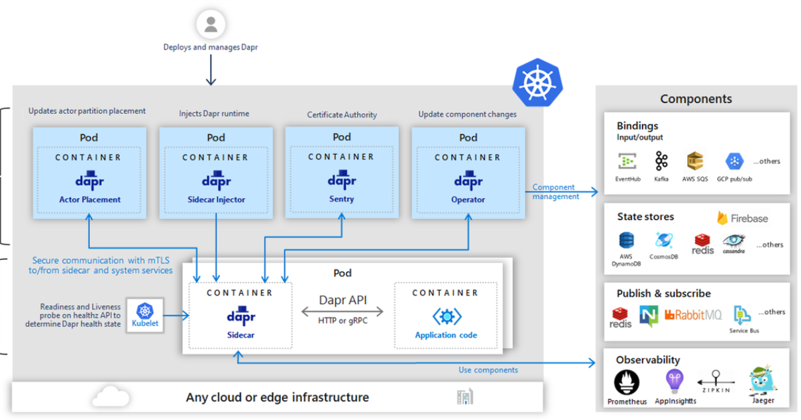

### 使用方式

* HTTP
* gRPC

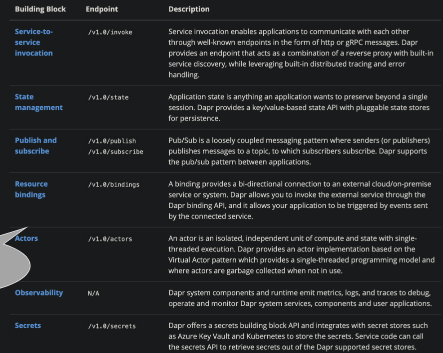

### 普及之后的一些可能性

* 公司内的框架组会消失
* 高可用高扩展性成为应用自动拥有的能力
* 流量回放不再是黑科技
* 小公司和大公司的基础设施不再有太大差距

## References

Multi-runtime

https://www.infoq.com/articles/multi-runtime-microservice-architecture/

从 service mesh 到 dapr

https://skyao.io/talk/202103-dapr-from-servicemesh-to-cloudnative/

Dapr 文档

https://docs.dapr.io/

Dapr 和 gRPC 结合使用

https://docs.dapr.io/developing-applications/building-blocks/service-invocation/howto-invoke-services-grpc/

mosn

https://github.com/mosn/mosn

## 作业

选做：
使用 Dapr 搭建一个简单的 hello 应用支持通过 key 进行 value 存取存储端可以使用 redis
