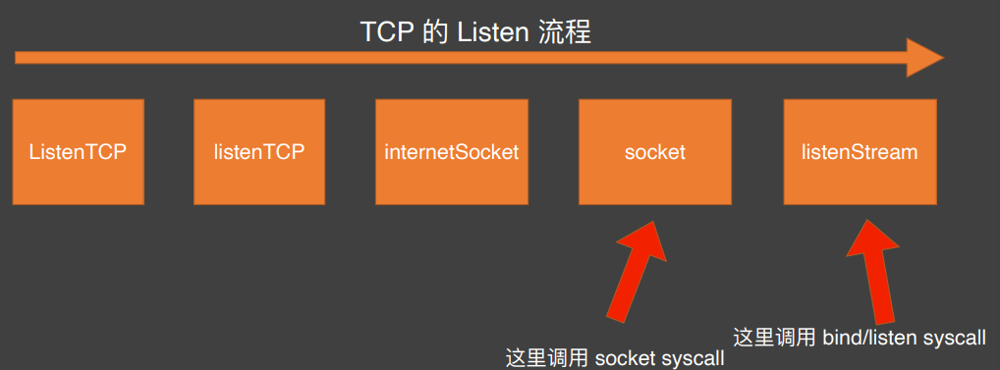
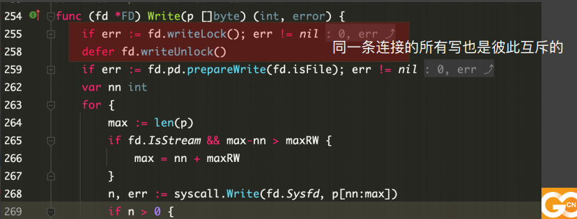

# netpoll 网络编程基础知识

## 网络编程基础知识

### 阻塞与非阻塞

EAGAIN 的处理方法
https://blog.csdn.net/timid_brother/article/details/52200737

### Go 语言中的网络程序
从 accept 开始，都是线性逻辑，流程是顺序的，符合人类思维习惯

Go 语言是怎么做到的呢？主要就是把 Read 和Write 的非阻塞流程封装成了阻塞流程。因为人们容量理解阻塞，但不容易理解回调

### Go 底层一堆 FD 之间的关系

### Go 底层一堆 FD 之间的关系

### Go 底层一堆 FD 之间的关系

### Go ⽹络编程基本流程-Epoll 初始化

### Go ⽹络编程基本流程-Listen

### Go ⽹络编程基本流程-Accept

### Go ⽹络编程基本流程-Read

### Go ⽹络编程基本流程-Write

### runtime.pollWait 实现

### netpoll 执⾏流程
在调度和 GC 的关键点上都会检查⼀次 netpoll，看是否有已经 ready 的 fd

相当于每次调度循环都要⾛到 netpoll，检查的频率还是⽐较⾼的

### netpoll 执⾏流程

已经 ready 的 goroutine push 到 toRun 链表

toRun 列表最终从 netpoll() 中返回，通过 injectglist 进⼊全局队列

### netpoll 与 timer 结合
有 timer 过期，且没有被 checkTimers 检查到，需要处理时：

唤醒可能正在阻塞的 netpoll 线程进⾏处理
这时候如果有阻塞的 epoll_wait，会⽴刻返回

### ⽹络连接上的读写锁
* 同⼀条连接上的读需要被序列化
* 同⼀条连接上的写需要被序列化
* 读和写可以并发
* 同⼀个 FD 上的读/写操作，底层是⼀定有锁的

### ⽹络连接上的读写锁
* 同⼀条连接上的读需要被序列化
* 同⼀条连接上的写需要被序列化
* 读和写可以并发
* 同⼀个 FD 上的读/写操作，底层是⼀定有锁的

### 标准库的 netpoll 缺陷分析
当前我们线上的系统，⼀般活跃连接较少，⼤多是类似于：
总连接数：5w；活跃连接数：1k 这样的情况，活跃连接在总连接中的⽐例较低。
不活跃的连接，⼀般情况下都是阻塞在 conn.Read上，
所有阻塞的 goroutine 都会占⽤ goroutine 的栈空间，以及 Read buffer 的空间

可以认为，这种模式最⼤的缺陷：那些不活跃的连接要占⽤太多的资源

### 社区⾥的 netpoll 到底在优化什么？

